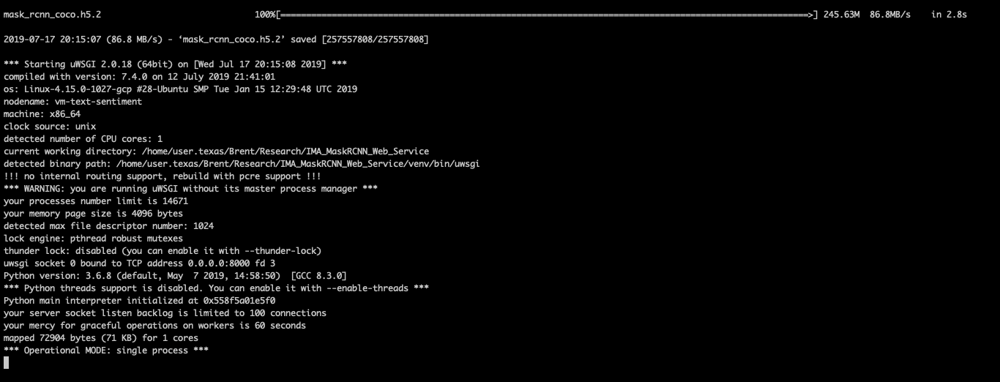

# We will run this with an NGINX instance

## Connect to server via ssh and forward your local machine's port 8000 to the server's port 8000. Be sure to have saved the private key to ~/.ssh. 

```bash
ssh -i ~/.ssh/uni_tx <user_name>@34.73.225.25 -L 8000:localhost:8000
```
where "<user_name>" would be replaced by your actual username. 

## How to run

CD into the directory of this project and running the following command: 

```bash
source setup.sh
```

The setup file will create a virtual environment, install dependencies, download the weights file, and start the program. If you want to stop the server, press "Control + C" on your keyboard. Then, to restart the server:

```bash
uwsgi --socket 0.0.0.0:8000 --protocol=http -w main
```
You'll know the setup.sh script has finished when you encounter the following screen:



On your local machine, navigate to *localhost:8000* in a web browser. You should be presented with a screen like this:


Click on the button that says "Choose file" and select an image to send to the server:


Wait for the server to process the image. When finished, a JSON file containing all detections in the image will start downloading.


The picture below is a picture that was fed through the server. The JSON below it corresponds to the detections that the server found. Note that the JSON is formatted in MS COCO style. 


```bash
{
    "images": [
        {
            "file_name": "person.jpg",
            "height": 863,
            "width": 1300,
            "id": 0
        }
    ],
    "annotations": [
        {
            "segmentation": [
                [
                    319.0,
                    1218.5,
                    318.0,
                    1218.5,
                    317.0,
                    1218.5,
                    316.0,
                    1218.5,
                    315.0,
                    1218.5,
                    314.0,
                    1218.5,
                    313.0,
                    1218.5,
                    312.0,
                    1218.5,
                    311.0,
                    1218.5,
                    310.0,
                    1218.5,
                    309.0,
                    1218.5,
                    308.5,
                    1218.0,
                    308.0,
                    1217.5,
                    307.0,
                    1217.5,
                    306.0,
                    1217.5,
                    305.0,
                    1217.5,
                    304.0,
                    1217.5,
                    303.0,
                    1217.5,
                    302.0,
                    1217.5,
                    301.0,
                    1217.5,
                    300.5,
                    1217.0,
                    300.0,
                    1216.5,
                    299.0,
                    1216.5,
                    298.0,
                    1216.5,
                    297.5,
                    1216.0,
                    297.0,
                    1215.5,
                    296.5,
                    1215.0,
                    296.0,
                    1214.5,
                    295.0,
                    1214.5,
                    294.5,
                    1214.0,
                    294.0,
                    1213.5,
                    293.5,
                    1213.0,
                    293.0,
                    1212.5,
                    292.0,
                    1212.5,
                    291.5,
                    1212.0,
                    291.0,
                    1211.5,
                    290.5,
                    1211.0,
                    290.0,
                    1210.5,
                    289.5,
                    1210.0,
                    289.0,
                    1209.5,
                    288.0,
                    1209.5,
                    287.5,
                    1209.0,
                    287.0,
                    1208.5,
                    286.5,
                    1208.0,
                    286.5,
                    1207.0,
                    286.0,
                    1206.5,
                    285.5,
                    1206.0,
                    285.5,
                    1205.0,
                    285.0,
                    1204.5,
                    284.5,
                    1204.0,
                    284.5,
                    1203.0,
                    284.0,
                    1202.5,
                    283.5,
                    1202.0,
                    283.5,
                    1201.0,
                    283.5,
                    1200.0,
                    283.5,
                    1199.0,
                    283.5,
                    1198.0,
                    283.5,
                    1197.0,
                    283.5,
                    1196.0,
                    283.5,
                    1195.0,
                    283.5,
                    1194.0,
                    283.5,
                    1193.0,
                    283.5,
                    1192.0,
                    283.5,
                    1191.0,
                    283.5,
                    1190.0,
                    283.5,
                    1189.0,
                    283.5,
                    1188.0,
                    283.5,
                    1187.0,
                    283.5,
                    1186.0,
                    283.5,
                    1185.0,
                    283.5,
                    1184.0,
                    283.5,
                    1183.0,
                    283.5,
                    1182.0,
                    283.5,
                    1181.0,
                    283.5,
                    1180.0,
                    283.5,
                    1179.0,
                    283.5,
                    1178.0,
                    283.5,
                    1177.0,
                    283.0,
                    1176.5,
                    282.5,
                    1176.0,
                    282.5,
                    1175.0,
                    282.5,
                    1174.0,
                    282.5,
                    1173.0,
                    282.5,
                    1172.0,
                    282.5,
                    1171.0,
                    282.5,
                    1170.0,
                    282.5,
                    1169.0,
                    282.5,
                    1168.0,
                    282.5,
                    1167.0,
                    282.5,
                    1166.0,
                    282.5,
                    1165.0,
                    282.5,
                    1164.0,
                    282.5,
                    1163.0,
                    282.5,
                    1162.0,
                    282.5,
                    1161.0,
                    283.0,
                    1160.5,
                    283.5,
                    1160.0,
                    283.5,
                    1159.0,
                    283.5,
                    1158.0,
                    283.5,
                    1157.0,
                    284.0,
                    1156.5,
                    284.5,
                    1156.0,
                    284.5,
                    1155.0,
                    284.5,
                    1154.0,
                    284.5,
                    1153.0,
                    285.0,
                    1152.5,
                    285.5,
                    1152.0,
                    285.5,
                    1151.0,
                    285.5,
                    1150.0,
                    286.0,
                    1149.5,
                    286.5,
                    1149.0,
                    286.5,
                    1148.0,
                    287.0,
                    1147.5,
                    287.5,
                    1147.0,
                    287.5,
                    1146.0,
                    288.0,
                    1145.5,
                    288.5,
                    1145.0,
                    288.5,
                    1144.0,
                    289.0,
                    1143.5,
                    289.5,
                    1143.0,
                    289.5,
                    1142.0,
                    290.0,
                    1141.5,
                    290.5,
                    1141.0,
                    290.5,
                    1140.0,
                    291.0,
                    1139.5,
                    291.5,
                    1139.0,
                    291.5,
                    1138.0,
                    292.0,
                    1137.5,
                    292.5,
                    1137.0,
                    292.5,
                    1136.0,
                    292.5,
                    1135.0,
                    293.0,
                    1134.5,
                    293.5,
                    1134.0,
                    293.5,
                    1133.0,
                    294.0,
                    1132.5,
                    294.5,
                    1132.0,
                    294.5,
                    1131.0,
                    294.5,
                    1130.0,
                    295.0,
                    1129.5,
                    295.5,
                    1129.0,
                    295.5,
                    1128.0,
                    295.5,
                    1127.0,
                    296.0,
                    1126.5,
                    296.5,
                    1126.0,
                    296.5,
                    1125.0,
                    297.0,
                    1124.5,
                    297.5,
                    1124.0,
                    297.5,
                    1123.0,
                    297.5,
                    1122.0,
                    297.5,
                    1121.0,
                    298.0,
                    1120.5,
                    298.5,
                    1120.0,
                    298.5,
                    1119.0,
                    298.5,
                    1118.0,
                    298.5,
                    1117.0,
                    298.5,
                    1116.0,
                    298.5,
                    1115.0,
                    299.0,
                    1114.5,
                    299.5,
                    1114.0,
                    299.5,
                    1113.0,
                    299.5,
                    1112.0,
                    299.5,
                    1111.0,
                    299.5,
                    1110.0,
                    299.5,
                    1109.0,
                    299.5,
                    1108.0,
                    300.0,
                    1107.5,
                    300.5,
                    1107.0,
                    300.5,
                    1106.0,
                    300.5,
                    1105.0,
                    300.5,
                    1104.0,
                    300.5,
                    1103.0,
                    300.5,
                    1102.0,
                    300.5,
                    1101.0,
                    300.5,
                    1100.0,
                    301.0,
                    1099.5,
                    301.5,
                    1099.0,
                    301.5,
                    1098.0,
                    301.5,
                    1097.0,
                    301.5,
                    1096.0,
                    301.5,
                    1095.0,
                    301.5,
                    1094.0,
                    301.5,
                    1093.0,
                    301.5,
                    1092.0,
                    301.5,
                    1091.0,
                    302.0,
                    1090.5,
                    302.5,
                    1090.0,
                    302.5,
                    1089.0,
                    302.5,
                    1088.0,
                    302.5,
                    1087.0,
                    302.5,
                    1086.0,
                    302.5,
                    1085.0,
                    302.5,
                    1084.0,
                    302.5,
                    1083.0,
                    302.5,
                    1082.0,
                    302.5,
                    1081.0,
                    302.5,
                    1080.0,
                    302.5,
                    1079.0,
                    302.5,
                    1078.0,
                    302.5,
                    1077.0,
                    303.0,
                    1076.5,
                    303.5,
                    1076.0,
                    303.5,
                    1075.0,
                    303.5,
                    1074.0,
                    303.5,
                    1073.0,
                    303.5,
                    1072.0,
                    303.5,
                    1071.0,
                    303.5,
                    1070.0,
                    303.5,
                    1069.0,
                    303.5,
                    1068.0,
                    303.5,
                    1067.0,
                    303.5,
                    1066.0,
                    303.5,
                    1065.0,
                    303.5,
                    1064.0,
                    303.5,
                    1063.0,
                    303.5,
                    1062.0,
                    303.5,
                    1061.0,
                    303.5,
                    1060.0,
                    303.5,
                    1059.0,
                    303.5,
                    1058.0,
                    303.5,
                    1057.0,
                    303.5,
                    1056.0,
                    303.5,
                    1055.0,
                    303.5,
                    1054.0,
                    303.5,
                    1053.0,
                    303.5,
                    1052.0,
                    303.5,
                    1051.0,
                    303.5,
                    1050.0,
                    303.5,
                    1049.0,
                    303.5,
                    1048.0,
                    303.5,
                    1047.0,
                    303.5,
                    1046.0,
                    303.5,
                    1045.0,
                    303.5,
                    1044.0,
                    303.5,
                    1043.0,
                    303.5,
                    1042.0,
                    303.5,
                    1041.0,
                    303.5,
                    1040.0,
                    304.0,
                    1039.5,
                    304.5,
                    1039.0,
                    304.5,
                    1038.0,
                    304.5,
                    1037.0,
                    304.5,
                    1036.0,
                    304.5,
                    1035.0,
                    304.5,
                    1034.0,
                    304.5,
                    1033.0,
                    304.5,
                    1032.0,
                    304.5,
                    1031.0,
                    304.5,
                    1030.0,
                    304.5,
                    1029.0,
                    304.5,
                    1028.0,
                    304.5,
                    1027.0,
                    304.5,
                    1026.0,
                    304.5,
                    1025.0,
                    304.5,
                    1024.0,
                    304.5,
                    1023.0,
                    304.5,
                    1022.0,
                    304.5,
                    1021.0,
                    304.5,
                    1020.0,
                    304.5,
                    1019.0,
                    304.5,
                    1018.0,
                    304.5,
                    1017.0,
                    304.5,
                    1016.0,
                    304.5,
                    1015.0,
                    304.5,
                    1014.0,
                    304.5,
                    1013.0,
                    304.5,
                    1012.0,
                    304.5,
                    1011.0,
                    304.5,
                    1010.0,
                    304.5,
                    1009.0,
                    304.5,
                    1008.0,
                    304.5,
                    1007.0,
                    304.5,
                    1006.0,
                    304.5,
                    1005.0,
                    304.5,
                    1004.0,
                    304.5,
                    1003.0,
                    304.5,
                    1002.0,
                    304.5,
                    1001.0,
                    304.5,
                    1000.0,
                    304.5,
                    999.0,
                    304.5,
                    998.0,
                    304.5,
                    997.0,
                    304.5,
                    996.0,
                    304.5,
                    995.0,
                    304.5,
                    994.0,
                    304.5,
                    993.0,
                    304.5,
                    992.0,
                    304.5,
                    991.0,
                    304.5,
                    990.0,
                    304.5,
                    989.0,
                    304.5,
                    988.0,
                    304.5,
                    987.0,
                    304.5,
                    986.0,
                    304.5,
                    985.0,
                    304.5,
                    984.0,
                    304.5,
                    983.0,
                    304.5,
                    982.0,
                    304.5,
                    981.0,
                    304.5,
                    980.0,
                    304.5,
                    979.0,
                    304.5,
                    978.0,
                    304.5,
                    977.0,
                    304.5,
                    976.0,
                    304.5,
                    975.0,
                    304.5,
                    974.0,
                    304.5,
                    973.0,
                    304.5,
                    972.0,
                    305.0,
                    971.5,
                    305.5,
                    971.0,
                    305.5,
                    970.0,
                    305.5,
                    969.0,
                    305.5,
                    968.0,
                    305.5,
                    967.0,
                    305.5,
                    966.0,
                    305.5,
                    965.0,
                    305.5,
                    964.0,
                    305.5,
                    963.0,
                    305.5,
                    962.0,
                    305.5,
                    961.0,
                    305.5,
                    960.0,
                    305.5,
                    959.0,
                    305.5,
                    958.0,
                    305.5,
                    957.0,
                    305.5,
                    956.0,
                    305.5,
                    955.0,
                    305.5,
                    954.0,
                    305.5,
                    953.0,
                    305.5,
                    952.0,
                    305.5,
                    951.0,
                    305.5,
                    950.0,
                    305.5,
                    949.0,
                    305.5,
                    948.0,
                    305.5,
                    947.0,
                    305.5,
                    946.0,
                    305.5,
                    945.0,
                    305.5,
                    944.0,
                    305.5,
                    943.0,
                    305.5,
                    942.0,
                    305.5,
                    941.0,
                    305.5,
                    940.0,
                    305.5,
                    939.0,
                    305.5,
                    938.0,
                    305.5,
                    937.0,
                    305.5,
                    936.0,
                    305.5,
                    935.0,
                    305.5,
                    934.0,
                    305.5,
                    933.0,
                    305.5,
                    932.0,
                    305.5,
                    931.0,
                    306.0,
                    930.5,
                    306.5,
                    930.0,
                    306.5,
                    929.0,
                    306.5,
                    928.0,
                    306.5,
                    927.0,
                    306.5,
                    926.0,
                    306.5,
                    925.0,
                    306.5,
                    924.0,
                    306.5,
                    923.0,
                    306.5,
                    922.0,
                    306.5,
                    921.0,
                    306.5,
                    920.0,
                    306.5,
                    919.0,
                    306.5,
                    918.0,
                    306.5,
                    917.0,
                    306.5,
                    916.0,
                    306.5,
                    915.0,
                    306.5,
                    914.0,
                    306.5,
                    913.0,
                    306.5,
                    912.0,
                    306.5,
                    911.0,
                    306.5,
                    910.0,
                    306.5,
                    909.0,
                    306.5,
                    908.0,
                    306.5,
                    907.0,
                    306.5,
                    906.0,
                    306.5,
                    905.0,
                    306.5,
                    904.0,
                    306.5,
                    903.0,
                    306.5,
                    902.0,
                    306.5,
                    901.0,
                    306.5,
                    900.0,
                    307.0,
                    899.5,
                    307.5,
                    899.0,
                    307.5,
                    898.0,
                    307.5,
                    897.0,
                    307.5,
                    896.0,
                    307.5,
                    895.0,
                    307.5,
                    894.0,
                    307.5,
                    893.0,
                    307.5,
                    892.0,
                    307.5,
                    891.0,
                    307.5,
                    890.0,
                    307.5,
                    889.0,
                    307.5,
                    888.0,
                    307.5,
                    887.0,
                    307.5,
                    886.0,
                    307.5,
                    885.0,
                    307.5,
                    884.0,
                    307.5,
                    883.0,
                    307.5,
                    882.0,
                    307.5,
                    881.0,
                    307.5,
                    880.0,
                    307.5,
                    879.0,
                    307.5,
                    878.0,
                    307.5,
                    877.0,
                    307.5,
                    876.0,
                    307.5,
                    875.0,
                    307.5,
                    874.0,
                    307.5,
                    873.0,
                    307.5,
                    872.0,
                    307.5,
                    871.0,
                    307.5,
                    870.0,
                    307.5,
                    869.0,
                    307.5,
                    868.0,
                    307.5,
                    867.0,
                    307.5,
                    866.0,
                    307.5,
                    865.0,
                    307.5,
                    864.0,
                    307.5,
                    863.0,
                    307.5,
                    862.0,
                    307.5,
                    861.0,
                    307.5,
                    860.0,
                    307.5,
                    859.0,
                    307.5,
                    858.0,
                    307.5,
                    857.0,
                    307.5,
                    856.0,
                    307.5,
                    855.0,
                    307.5,
                    854.0,
                    307.5,
                    853.0,
                    307.5,
                    852.0,
                    307.5,
                    851.0,
                    307.5,
                    850.0,
                    307.5,
                    849.0,
                    307.5,
                    848.0,
                    307.5,
                    847.0,
                    307.5,
                    846.0,
                    307.5,
                    845.0,
                    307.5,
                    844.0,
                    307.5,
                    843.0,
                    307.5,
                    842.0,
                    307.5,
                    841.0,
                    307.5,
                    840.0,
                    307.5,
                    839.0,
                    307.5,
                    838.0,
                    307.5,
                    837.0,
                    307.5,
                    836.0,
                    307.5,
                    835.0,
                    307.5,
                    834.0,
                    307.5,
                    833.0,
                    307.5,
                    832.0,
                    307.5,
                    831.0,
                    307.5,
                    830.0,
                    307.5,
                    829.0,
                    307.5,
                    828.0,
                    307.5,
                    827.0,
                    307.5,
                    826.0,
                    307.5,
                    825.0,
                    307.5,
                    824.0,
                    307.5,
                    823.0,
                    307.5,
                    822.0,
                    307.5,
                    821.0,
                    307.5,
                    820.0,
                    307.5,
                    819.0,
                    307.5,
                    818.0,
                    307.5,
                    817.0,
                    307.5,
                    816.0,
                    307.5,
                    815.0,
                    307.5,
                    814.0,
                    307.5,
                    813.0,
                    307.5,
                    812.0,
                    307.5,
                    811.0,
                    307.5,
                    810.0,
                    307.5,
                    809.0,
                    307.5,
                    808.0,
                    307.5,
                    807.0,
                    307.5,
                    806.0,
                    307.5,
                    805.0,
                    307.5,
                    804.0,
                    307.5,
                    803.0,
                    307.5,
                    802.0,
                    307.5,
                    801.0,
                    307.5,
                    800.0,
                    307.5,
                    799.0,
                    307.5,
                    798.0,
                    307.5,
                    797.0,
                    307.5,
                    796.0,
                    307.5,
                    795.0,
                    307.5,
                    794.0,
                    307.5,
                    793.0,
                    307.5,
                    792.0,
                    307.5,
                    791.0,
                    307.5,
                    790.0,
                    307.5,
                    789.0,
                    307.5,
                    788.0,
                    307.5,
                    787.0,
                    307.5,
                    786.0,
                    307.5,
                    785.0,
                    307.5,
                    784.0,
                    307.5,
                    783.0,
                    307.5,
                    782.0,
                    307.5,
                    781.0,
                    307.5,
                    780.0,
                    307.5,
                    779.0,
                    307.5,
                    778.0,
                    307.5,
                    777.0,
                    307.5,
                    776.0,
                    307.5,
                    775.0,
                    307.5,
                    774.0,
                    307.5,
                    773.0,
                    307.5,
                    772.0,
                    307.5,
                    771.0,
                    307.5,
                    770.0,
                    307.5,
                    769.0,
                    307.5,
                    768.0,
                    307.5,
                    767.0,
                    307.5,
                    766.0,
                    307.5,
                    765.0,
                    307.5,
                    764.0,
                    307.5,
                    763.0,
                    307.5,
                    762.0,
                    307.5,
                    761.0,
                    307.5,
                    760.0,
                    307.5,
                    759.0,
                    307.5,
                    758.0,
                    307.5,
                    757.0,
                    307.5,
                    756.0,
                    307.0,
                    755.5,
                    306.5,
                    755.0,
                    306.5,
                    754.0,
                    306.5,
                    753.0,
                    306.5,
                    752.0,
                    306.5,
                    751.0,
                    306.5,
                    750.0,
                    306.5,
                    749.0,
                    306.5,
                    748.0,
                    306.5,
                    747.0,
                    306.5,
                    746.0,
                    306.5,
                    745.0,
                    306.5,
                    744.0,
                    306.5,
                    743.0,
                    306.5,
                    742.0,
                    306.5,
                    741.0,
                    306.0,
                    740.5,
                    305.5,
                    740.0,
                    305.5,
                    739.0,
                    305.5,
                    738.0,
                    305.5,
                    737.0,
                    305.5,
                    736.0,
                    305.5,
                    735.0,
                    305.5,
                    734.0,
                    305.5,
                    733.0,
                    305.5,
                    732.0,
                    305.5,
                    731.0,
                    305.5,
                    730.0,
                    305.5,
                    729.0,
                    305.5,
                    728.0,
                    305.0,
                    727.5,
                    304.5,
                    727.0,
                    304.5,
                    726.0,
                    304.5,
                    725.0,
                    304.5,
                    724.0,
                    304.5,
                    723.0,
                    304.5,
                    722.0,
                    304.0,
                    721.5,
                    303.5,
                    721.0,
                    303.5,
                    720.0,
                    303.5,
                    719.0,
                    303.5,
                    718.0,
                    303.5,
                    717.0,
                    303.0,
                    716.5,
                    302.5,
                    716.0,
                    302.5,
                    715.0,
                    302.5,
                    714.0,
                    302.5,
                    713.0,
                    302.0,
                    712.5,
                    301.5,
                    712.0,
                    301.5,
                    711.0,
                    301.5,
                    710.0,
                    301.0,
                    709.5,
                    300.5,
                    709.0,
                    300.5,
                    708.0,
                    300.5,
                    707.0,
                    300.0,
                    706.5,
                    299.5,
                    706.0,
                    299.5,
                    705.0,
                    299.0,
                    704.5,
                    298.5,
                    704.0,
                    298.5,
                    703.0,
                    298.0,
                    702.5,
                    297.5,
                    702.0,
                    297.5,
                    701.0,
                    297.0,
                    700.5,
                    296.5,
                    700.0,
                    296.5,
                    699.0,
                    296.0,
                    698.5,
                    295.5,
                    698.0,
                    295.5,
                    697.0,
                    295.0,
                    696.5,
                    294.5,
                    696.0,
                    294.0,
                    695.5,
                    293.5,
                    695.0,
                    293.5,
                    694.0,
                    293.0,
                    693.5,
                    292.5,
                    693.0,
                    292.5,
                    692.0,
                    292.0,
                    691.5,
                    291.5,
                    691.0,
                    291.5,
                    690.0,
                    291.0,
                    689.5,
                    290.5,
                    689.0,
                    290.5,
                    688.0,
                    290.0,
                    687.5,
                    289.5,
                    687.0,
                    289.5,
                    686.0,
                    289.0,
                    685.5,
                    288.5,
                    685.0,
                    288.0,
                    684.5,
                    287.5,
                    684.0,
                    287.5,
                    683.0,
                    287.0,
                    682.5,
                    286.5,
                    682.0,
                    286.5,
                    681.0,
                    286.0,
                    680.5,
                    285.5,
                    680.0,
                    285.5,
                    679.0,
                    285.5,
                    678.0,
                    285.0,
                    677.5,
                    284.5,
                    677.0,
                    284.5,
                    676.0,
                    284.0,
                    675.5,
                    283.5,
                    675.0,
                    283.5,
                    674.0,
                    283.0,
                    673.5,
                    282.5,
                    673.0,
                    282.5,
                    672.0,
                    282.5,
                    671.0,
                    282.0,
                    670.5,
                    281.5,
                    670.0,
                    281.5,
                    669.0,
                    281.0,
                    668.5,
                    280.5,
                    668.0,
                    280.5,
                    667.0,
                    280.0,
                    666.5,
                    279.5,
                    666.0,
                    279.5,
                    665.0,
                    279.5,
                    664.0,
                    279.0,
                    663.5,
                    278.5,
                    663.0,
                    278.5,
                    662.0,
                    278.0,
                    661.5,
                    277.5,
                    661.0,
                    277.5,
                    660.0,
                    277.0,
                    659.5,
                    276.5,
                    659.0,
                    276.5,
                    658.0,
                    276.5,
                    657.0,
                    276.0,
                    656.5,
                    275.5,
                    656.0,
                    275.5,
                    655.0,
                    275.0,
                    654.5,
                    274.5,
                    654.0,
                    274.5,
                    653.0,
                    274.0,
                    652.5,
                    273.5,
                    652.0,
                    273.5,
                    651.0,
                    273.5,
                    650.0,
                    273.0,
                    649.5,
                    272.5,
                    649.0,
                    272.5,
                    648.0,
                    272.5,
                    647.0,
                    272.0,
                    646.5,
                    271.5,
                    646.0,
                    271.5,
                    645.0,
                    271.5,
                    644.0,
                    271.5,
                    643.0,
                    271.0,
                    642.5,
                    270.5,
                    642.0,
                    270.5,
                    641.0,
                    270.5,
                    640.0,
                    270.5,
                    639.0,
                    270.0,
                    638.5,
                    269.5,
                    638.0,
                    269.5,
                    637.0,
                    269.5,
                    636.0,
                    269.5,
                    635.0,
                    269.0,
                    634.5,
                    268.5,
                    634.0,
                    268.5,
                    633.0,
                    268.5,
                    632.0,
                    268.0,
                    631.5,
                    267.5,
                    631.0,
                    267.5,
                    630.0,
                    267.5,
                    629.0,
                    267.5,
                    628.0,
                    267.0,
                    627.5,
                    266.5,
                    627.0,
                    266.5,
                    626.0,
                    266.5,
                    625.0,
                    266.5,
                    624.0,
                    266.0,
                    623.5,
                    265.5,
                    623.0,
                    265.5,
                    622.0,
                    265.5,
                    621.0,
                    265.5,
                    620.0,
                    265.0,
                    619.5,
                    264.5,
                    619.0,
                    264.5,
                    618.0,
                    264.5,
                    617.0,
                    264.5,
                    616.0,
                    264.0,
                    615.5,
                    263.5,
                    615.0,
                    263.5,
                    614.0,
                    263.5,
                    613.0,
                    263.0,
                    612.5,
                    262.5,
                    612.0,
                    262.5,
                    611.0,
                    262.5,
                    610.0,
                    262.5,
                    609.0,
                    262.0,
                    608.5,
                    261.5,
                    608.0,
                    261.5,
                    607.0,
                    261.5,
                    606.0,
                    261.5,
                    605.0,
                    261.0,
                    604.5,
                    260.5,
                    604.0,
                    260.5,
                    603.0,
                    260.5,
                    602.0,
                    260.5,
                    601.0,
                    260.0,
                    600.5,
                    259.5,
                    600.0,
                    259.5,
                    599.0,
                    259.5,
                    598.0,
                    259.5,
                    597.0,
                    259.5,
                    596.0,
                    259.0,
                    595.5,
                    258.5,
                    595.0,
                    258.5,
                    594.0,
                    258.5,
                    593.0,
                    258.5,
                    592.0,
                    258.5,
                    591.0,
                    258.0,
                    590.5,
                    257.5,
                    590.0,
                    257.5,
                    589.0,
                    257.5,
                    588.0,
                    257.5,
                    587.0,
                    257.5,
                    586.0,
                    257.5,
                    585.0,
                    257.0,
                    584.5,
                    256.5,
                    584.0,
                    256.5,
                    583.0,
                    256.5,
                    582.0,
                    256.5,
                    581.0,
                    256.5,
                    580.0,
                    256.5,
                    579.0,
                    256.5,
                    578.0,
                    256.5,
                    577.0,
                    256.0,
                    576.5,
                    255.5,
                    576.0,
                    255.5,
                    575.0,
                    255.5,
                    574.0,
                    255.5,
                    573.0,
                    255.5,
                    572.0,
                    255.5,
                    571.0,
                    255.5,
                    570.0,
                    255.5,
                    569.0,
                    255.5,
                    568.0,
                    255.0,
                    567.5,
                    254.5,
                    567.0,
                    254.5,
                    566.0,
                    254.5,
                    565.0,
                    254.5,
                    564.0,
                    254.5,
                    563.0,
                    254.5,
                    562.0,
                    254.5,
                    561.0,
                    254.5,
                    560.0,
                    254.5,
                    559.0,
                    254.5,
                    558.0,
                    254.5,
                    557.0,
                    254.5,
                    556.0,
                    254.5,
                    555.0,
                    254.5,
                    554.0,
                    254.5,
                    553.0,
                    254.5,
                    552.0,
                    254.5,
                    551.0,
                    254.5,
                    550.0,
                    254.5,
                    549.0,
                    254.5,
                    548.0,
                    254.5,
                    547.0,
                    254.5,
                    546.0,
                    254.5,
                    545.0,
                    254.0,
                    544.5,
                    253.5,
                    544.0,
                    253.5,
                    543.0,
                    253.5,
                    542.0,
                    253.5,
                    541.0,
                    253.5,
                    540.0,
                    253.5,
                    539.0,
                    253.5,
                    538.0,
                    253.5,
                    537.0,
                    253.5,
                    536.0,
                    253.5,
                    535.0,
                    253.5,
                    534.0,
                    253.5,
                    533.0,
                    253.5,
                    532.0,
                    253.5,
                    531.0,
                    253.5,
                    530.0,
                    253.5,
                    529.0,
                    253.5,
                    528.0,
                    253.5,
                    527.0,
                    253.5,
                    526.0,
                    253.5,
                    525.0,
                    253.5,
                    524.0,
                    253.5,
                    523.0,
                    253.5,
                    522.0,
                    253.5,
                    521.0,
                    253.5,
                    520.0,
                    253.5,
                    519.0,
                    253.5,
                    518.0,
                    253.5,
                    517.0,
                    253.5,
                    516.0,
                    253.5,
                    515.0,
                    253.5,
                    514.0,
                    253.5,
                    513.0,
                    253.5,
                    512.0,
                    253.5,
                    511.0,
                    253.5,
                    510.0,
                    253.5,
                    509.0,
                    253.5,
                    508.0,
                    253.5,
                    507.0,
                    253.5,
                    506.0,
                    253.5,
                    505.0,
                    253.5,
                    504.0,
                    253.5,
                    503.0,
                    253.5,
                    502.0,
                    253.5,
                    501.0,
                    253.5,
                    500.0,
                    253.5,
                    499.0,
                    253.5,
                    498.0,
                    253.5,
                    497.0,
                    253.5,
                    496.0,
                    253.5,
                    495.0,
                    253.5,
                    494.0,
                    253.5,
                    493.0,
                    253.5,
                    492.0,
                    253.5,
                    491.0,
                    253.5,
                    490.0,
                    253.5,
                    489.0,
                    253.5,
                    488.0,
                    253.5,
                    487.0,
                    253.5,
                    486.0,
                    253.5,
                    485.0,
                    253.5,
                    484.0,
                    253.5,
                    483.0,
                    253.5,
                    482.0,
                    253.5,
                    481.0,
                    253.5,
                    480.0,
                    253.5,
                    479.0,
                    253.5,
                    478.0,
                    253.5,
                    477.0,
                    253.5,
                    476.0,
                    254.0,
                    475.5,
                    254.5,
                    475.0,
                    254.5,
                    474.0,
                    254.5,
                    473.0,
                    254.5,
                    472.0,
                    254.5,
                    471.0,
                    254.5,
                    470.0,
                    254.5,
                    469.0,
                    254.5,
                    468.0,
                    254.5,
                    467.0,
                    254.5,
                    466.0,
                    254.5,
                    465.0,
                    254.5,
                    464.0,
                    254.5,
                    463.0,
                    254.5,
                    462.0,
                    254.5,
                    461.0,
                    254.5,
                    460.0,
                    254.5,
                    459.0,
                    254.5,
                    458.0,
                    254.5,
                    457.0,
                    254.5,
                    456.0,
                    254.5,
                    455.0,
                    254.5,
                    454.0,
                    254.5,
                    453.0,
                    254.5,
                    452.0,
                    254.5,
                    451.0,
                    254.5,
                    450.0,
                    254.5,
                    449.0,
                    255.0,
                    448.5,
                    255.5,
                    448.0,
                    255.5,
                    447.0,
                    255.5,
                    446.0,
                    255.5,
                    445.0,
                    255.5,
                    444.0,
                    255.5,
                    443.0,
                    255.5,
                    442.0,
                    255.5,
                    441.0,
                    255.5,
                    440.0,
                    255.5,
                    439.0,
                    255.5,
                    438.0,
                    255.5,
                    437.0,
                    255.5,
                    436.0,
                    256.0,
                    435.5,
                    256.5,
                    435.0,
                    256.5,
                    434.0,
                    256.5,
                    433.0,
                    256.5,
                    432.0,
                    256.5,
                    431.0,
                    256.5,
                    430.0,
                    256.5,
                    429.0,
                    256.5,
                    428.0,
                    256.5,
                    427.0,
                    256.5,
                    426.0,
                    256.5,
                    425.0,
                    257.0,
                    424.5,
                    257.5,
                    424.0,
                    257.5,
                    423.0,
                    257.5,
                    422.0,
                    257.5,
                    421.0,
                    257.5,
                    420.0,
                    257.5,
                    419.0,
                    257.5,
                    418.0,
                    257.5,
                    417.0,
                    257.5,
                    416.0,
                    258.0,
                    415.5,
                    258.5,
                    415.0,
                    258.5,
                    414.0,
                    258.5,
                    413.0,
                    258.5,
                    412.0,
                    258.5,
                    411.0,
                    258.5,
                    410.0,
                    258.5,
                    409.0,
                    259.0,
                    408.5,
                    259.5,
                    408.0,
                    259.5,
                    407.0,
                    259.5,
                    406.0,
                    260.0,
                    405.5,
                    260.5,
                    405.0,
                    260.5,
                    404.0,
                    260.5,
                    403.0,
                    261.0,
                    402.5,
                    261.5,
                    402.0,
                    261.5,
                    401.0,
                    261.5,
                    400.0,
                    262.0,
                    399.5,
                    262.5,
                    399.0,
                    262.5,
                    398.0,
                    262.5,
                    397.0,
                    263.0,
                    396.5,
                    263.5,
                    396.0,
                    263.5,
                    395.0,
                    263.5,
                    394.0,
                    264.0,
                    393.5,
                    264.5,
                    393.0,
                    264.5,
                    392.0,
                    264.5,
                    391.0,
                    264.5,
                    390.0,
                    265.0,
                    389.5,
                    265.5,
                    389.0,
                    265.5,
                    388.0,
                    265.5,
                    387.0,
                    265.5,
                    386.0,
                    266.0,
                    385.5,
                    266.5,
                    385.0,
                    266.5,
                    384.0,
                    266.5,
                    383.0,
                    266.5,
                    382.0,
                    267.0,
                    381.5,
                    267.5,
                    381.0,
                    267.5,
                    380.0,
                    267.5,
                    379.0,
                    267.5,
                    378.0,
                    267.5,
                    377.0,
                    268.0,
                    376.5,
                    268.5,
                    376.0,
                    268.5,
                    375.0,
                    268.5,
                    374.0,
                    268.5,
                    373.0,
                    268.5,
                    372.0,
                    269.0,
                    371.5,
                    269.5,
                    371.0,
                    269.5,
                    370.0,
                    269.5,
                    369.0,
                    269.5,
                    368.0,
                    270.0,
                    367.5,
                    270.5,
                    367.0,
                    270.5,
                    366.0,
                    270.5,
                    365.0,
                    270.5,
                    364.0,
                    271.0,
                    363.5,
                    271.5,
                    363.0,
                    271.5,
                    362.0,
                    272.0,
                    361.5,
                    272.5,
                    361.0,
                    272.5,
                    360.0,
                    272.5,
                    359.0,
                    273.0,
                    358.5,
                    273.5,
                    358.0,
                    273.5,
                    357.0,
                    274.0,
                    356.5,
                    274.5,
                    356.0,
                    275.0,
                    355.5,
                    275.5,
                    355.0,
                    276.0,
                    354.5,
                    276.5,
                    354.0,
                    277.0,
                    353.5,
                    277.5,
                    353.0,
                    278.0,
                    352.5,
                    278.5,
                    352.0,
                    279.0,
                    351.5,
                    279.5,
                    351.0,
                    280.0,
                    350.5,
                    280.5,
                    350.0,
                    281.0,
                    349.5,
                    281.5,
                    349.0,
                    282.0,
                    348.5,
                    283.0,
                    348.5,
                    283.5,
                    348.0,
                    284.0,
                    347.5,
                    284.5,
                    347.0,
                    285.0,
                    346.5,
                    285.5,
                    346.0,
                    286.0,
                    345.5,
                    286.5,
                    345.0,
                    287.0,
                    344.5,
                    287.5,
                    344.0,
                    287.5,
                    343.0,
                    288.0,
                    342.5,
                    288.5,
                    342.0,
                    288.5,
                    341.0,
                    289.0,
                    340.5,
                    289.5,
                    340.0,
                    289.5,
                    339.0,
                    290.0,
                    338.5,
                    290.5,
                    338.0,
                    290.5,
                    337.0,
                    291.0,
                    336.5,
                    291.5,
                    336.0,
                    291.5,
                    335.0,
                    291.5,
                    334.0,
                    292.0,
                    333.5,
                    292.5,
                    333.0,
                    292.5,
                    332.0,
                    292.5,
                    331.0,
                    292.5,
                    330.0,
                    293.0,
                    329.5,
                    293.5,
                    329.0,
                    293.5,
                    328.0,
                    293.5,
                    327.0,
                    294.0,
                    326.5,
                    294.5,
                    326.0,
                    294.5,
                    325.0,
                    294.5,
                    324.0,
                    295.0,
                    323.5,
                    295.5,
                    323.0,
                    295.5,
                    322.0,
                    296.0,
                    321.5,
                    296.5,
                    321.0,
                    296.5,
                    320.0,
                    297.0,
                    319.5,
                    297.5,
                    319.0,
                    297.5,
                    318.0,
                    298.0,
                    317.5,
                    298.5,
                    317.0,
                    299.0,
                    316.5,
                    299.5,
                    316.0,
                    300.0,
                    315.5,
                    300.5,
                    315.0,
                    301.0,
                    314.5,
                    302.0,
                    314.5,
                    302.5,
                    314.0,
                    303.0,
                    313.5,
                    304.0,
                    313.5,
                    304.5,
                    313.0,
                    305.0,
                    312.5,
                    306.0,
                    312.5,
                    307.0,
                    312.5,
                    307.5,
                    312.0,
                    308.0,
                    311.5,
                    309.0,
                    311.5,
                    310.0,
                    311.5,
                    310.5,
                    311.0,
                    311.0,
                    310.5,
                    312.0,
                    310.5,
                    313.0,
                    310.5,
                    313.5,
                    310.0,
                    314.0,
                    309.5,
                    315.0,
                    309.5,
                    316.0,
                    309.5,
                    316.5,
                    309.0,
                    317.0,
                    308.5,
                    318.0,
                    308.5,
                    319.0,
                    308.5,
                    319.5,
                    308.0,
                    320.0,
                    307.5,
                    321.0,
                    307.5,
                    321.5,
                    307.0,
                    322.0,
                    306.5,
                    323.0,
                    306.5,
                    324.0,
                    306.5,
                    324.5,
                    306.0,
                    325.0,
                    305.5,
                    325.5,
                    305.0,
                    326.0,
                    304.5,
                    326.5,
                    304.0,
                    327.0,
                    303.5,
                    327.5,
                    303.0,
                    328.0,
                    302.5,
                    328.5,
                    302.0,
                    329.0,
                    301.5,
                    329.5,
                    301.0,
                    329.5,
                    300.0,
                    330.0,
                    299.5,
                    330.5,
                    299.0,
                    331.0,
                    298.5,
                    331.5,
                    298.0,
                    331.5,
                    297.0,
                    332.0,
                    296.5,
                    332.5,
                    296.0,
                    332.5,
                    295.0,
                    333.0,
                    294.5,
                    333.5,
                    294.0,
                    333.5,
                    293.0,
                    334.0,
                    292.5,
                    334.5,
                    292.0,
                    334.5,
                    291.0,
                    335.0,
                    290.5,
                    335.5,
                    290.0,
                    335.5,
                    289.0,
                    335.5,
                    288.0,
                    336.0,
                    287.5,
                    336.5,
                    287.0,
                    336.5,
                    286.0,
                    337.0,
                    285.5,
                    337.5,
                    285.0,
                    338.0,
                    284.5,
                    338.5,
                    284.0,
                    338.5,
                    283.0,
                    339.0,
                    282.5,
                    339.5,
                    282.0,
                    340.0,
                    281.5,
                    340.5,
                    281.0,
                    341.0,
                    280.5,
                    342.0,
                    280.5,
                    342.5,
                    280.0,
                    343.0,
                    279.5,
                    343.5,
                    279.0,
                    344.0,
                    278.5,
                    344.5,
                    278.0,
                    345.0,
                    277.5,
                    345.5,
                    277.0,
                    346.0,
                    276.5,
                    347.0,
                    276.5,
                    347.5,
                    276.0,
                    348.0,
                    275.5,
                    348.5,
                    275.0,
                    349.0,
                    274.5,
                    350.0,
                    274.5,
                    350.5,
                    274.0,
                    351.0,
                    273.5,
                    351.5,
                    273.0,
                    352.0,
                    272.5,
                    353.0,
                    272.5,
                    353.5,
                    272.0,
                    354.0,
                    271.5,
                    354.5,
                    271.0,
                    355.0,
                    270.5,
                    355.5,
                    270.0,
                    356.0,
                    269.5,
                    357.0,
                    269.5,
                    357.5,
                    269.0,
                    358.0,
                    268.5,
                    358.5,
                    268.0,
                    359.0,
                    267.5,
                    359.5,
                    267.0,
                    360.0,
                    266.5,
                    360.5,
                    266.0,
                    361.0,
                    265.5,
                    361.5,
                    265.0,
                    362.0,
                    264.5,
                    362.5,
                    264.0,
                    363.0,
                    263.5,
                    363.5,
                    263.0,
                    364.0,
                    262.5,
                    364.5,
                    262.0,
                    365.0,
                    261.5,
                    365.5,
                    261.0,
                    365.5,
                    260.0,
                    366.0,
                    259.5,
                    366.5,
                    259.0,
                    366.5,
                    258.0,
                    367.0,
                    257.5,
                    367.5,
                    257.0,
                    367.5,
                    256.0,
                    367.5,
                    255.0,
                    368.0,
                    254.5,
                    368.5,
                    254.0,
                    368.5,
                    253.0,
                    368.5,
                    252.0,
                    369.0,
                    251.5,
                    369.5,
                    251.0,
                    369.5,
                    250.0,
                    369.5,
                    249.0,
                    369.5,
                    248.0,
                    370.0,
                    247.5,
                    370.5,
                    247.0,
                    370.5,
                    246.0,
                    370.5,
                    245.0,
                    370.5,
                    244.0,
                    370.5,
                    243.0,
                    371.0,
                    242.5,
                    371.5,
                    242.0,
                    371.5,
                    241.0,
                    371.5,
                    240.0,
                    371.5,
                    239.0,
                    371.5,
                    238.0,
                    372.0,
                    237.5,
                    372.5,
                    237.0,
                    372.5,
                    236.0,
                    372.5,
                    235.0,
                    372.5,
                    234.0,
                    373.0,
                    233.5,
                    373.5,
                    233.0,
                    373.5,
                    232.0,
                    373.5,
                    231.0,
                    373.5,
                    230.0,
                    374.0,
                    229.5,
                    374.5,
                    229.0,
                    374.5,
                    228.0,
                    374.5,
                    227.0,
                    374.5,
                    226.0,
                    375.0,
                    225.5,
                    375.5,
                    225.0,
                    375.5,
                    224.0,
                    375.5,
                    223.0,
                    375.5,
                    222.0,
                    376.0,
                    221.5,
                    376.5,
                    221.0,
                    376.5,
                    220.0,
                    376.5,
                    219.0,
                    377.0,
                    218.5,
                    377.5,
                    218.0,
                    377.5,
                    217.0,
                    377.5,
                    216.0,
                    377.5,
                    215.0,
                    377.5,
                    214.0,
                    378.0,
                    213.5,
                    378.5,
                    213.0,
                    378.5,
                    212.0,
                    378.5,
                    211.0,
                    378.5,
                    210.0,
                    378.5,
                    209.0,
                    379.0,
                    208.5,
                    379.5,
                    208.0,
                    379.5,
                    207.0,
                    379.5,
                    206.0,
                    379.5,
                    205.0,
                    379.5,
                    204.0,
                    379.5,
                    203.0,
                    379.5,
                    202.0,
                    379.5,
                    201.0,
                    380.0,
                    200.5,
                    380.5,
                    200.0,
                    380.5,
                    199.0,
                    380.5,
                    198.0,
                    380.5,
                    197.0,
                    380.5,
                    196.0,
                    380.5,
                    195.0,
                    380.5,
                    194.0,
                    381.0,
                    193.5,
                    381.5,
                    193.0,
                    381.5,
                    192.0,
                    381.5,
                    191.0,
                    381.5,
                    190.0,
                    381.5,
                    189.0,
                    381.5,
                    188.0,
                    381.5,
                    187.0,
                    381.5,
                    186.0,
                    382.0,
                    185.5,
                    382.5,
                    185.0,
                    382.5,
                    184.0,
                    382.5,
                    183.0,
                    382.5,
                    182.0,
                    382.5,
                    181.0,
                    382.5,
                    180.0,
                    382.5,
                    179.0,
                    382.5,
                    178.0,
                    382.5,
                    177.0,
                    383.0,
                    176.5,
                    383.5,
                    176.0,
                    383.5,
                    175.0,
                    383.5,
                    174.0,
                    383.5,
                    173.0,
                    383.5,
                    172.0,
                    383.5,
                    171.0,
                    383.5,
                    170.0,
                    383.5,
                    169.0,
                    384.0,
                    168.5,
                    384.5,
                    168.0,
                    384.5,
                    167.0,
                    384.5,
                    166.0,
                    384.5,
                    165.0,
                    384.5,
                    164.0,
                    385.0,
                    163.5,
                    385.5,
                    163.0,
                    385.5,
                    162.0,
                    385.5,
                    161.0,
                    385.5,
                    160.0,
                    385.5,
                    159.0,
                    386.0,
                    158.5,
                    386.5,
                    158.0,
                    386.5,
                    157.0,
                    386.5,
                    156.0,
                    386.5,
                    155.0,
                    386.5,
                    154.0,
                    387.0,
                    153.5,
                    387.5,
                    153.0,
                    387.5,
                    152.0,
                    387.5,
                    151.0,
                    388.0,
                    150.5,
                    388.5,
                    150.0,
                    388.5,
                    149.0,
                    388.5,
                    148.0,
                    388.5,
                    147.0,
                    389.0,
                    146.5,
                    389.5,
                    146.0,
                    389.5,
                    145.0,
                    389.5,
                    144.0,
                    390.0,
                    143.5,
                    390.5,
                    143.0,
                    390.5,
                    142.0,
                    390.5,
                    141.0,
                    391.0,
                    140.5,
                    391.5,
                    140.0,
                    391.5,
                    139.0,
                    391.5,
                    138.0,
                    392.0,
                    137.5,
                    392.5,
                    137.0,
                    392.5,
                    136.0,
                    392.5,
                    135.0,
                    392.5,
                    134.0,
                    393.0,
                    133.5,
                    393.5,
                    133.0,
                    393.5,
                    132.0,
                    393.5,
                    131.0,
                    394.0,
                    130.5,
                    394.5,
                    130.0,
                    394.5,
                    129.0,
                    395.0,
                    128.5,
                    395.5,
                    128.0,
                    395.5,
                    127.0,
                    396.0,
                    126.5,
                    396.5,
                    126.0,
                    396.5,
                    125.0,
                    397.0,
                    124.5,
                    397.5,
                    124.0,
                    397.5,
                    123.0,
                    398.0,
                    122.5,
                    398.5,
                    122.0,
                    399.0,
                    121.5,
                    399.5,
                    121.0,
                    399.5,
                    120.0,
                    400.0,
                    119.5,
                    400.5,
                    119.0,
                    401.0,
                    118.5,
                    401.5,
                    118.0,
                    402.0,
                    117.5,
                    402.5,
                    117.0,
                    403.0,
                    116.5,
                    404.0,
                    116.5,
                    405.0,
                    116.5,
                    406.0,
                    116.5,
                    406.5,
                    116.0,
                    407.0,
                    115.5,
                    408.0,
                    115.5,
                    409.0,
                    115.5,
                    410.0,
                    115.5,
                    410.5,
                    115.0,
                    411.0,
                    114.5,
                    412.0,
                    114.5,
                    413.0,
                    114.5,
                    414.0,
                    114.5,
                    415.0,
                    114.5,
                    415.5,
                    114.0,
                    416.0,
                    113.5,
                    417.0,
                    113.5,
                    418.0,
                    113.5,
                    419.0,
                    113.5,
                    420.0,
                    113.5,
                    421.0,
                    113.5,
                    422.0,
                    113.5,
                    423.0,
                    113.5,
                    424.0,
                    113.5,
                    425.0,
                    113.5,
                    426.0,
                    113.5,
                    427.0,
                    113.5,
                    428.0,
                    113.5,
                    429.0,
                    113.5,
                    430.0,
                    113.5,
                    431.0,
                    113.5,
                    432.0,
                    113.5,
                    433.0,
                    113.5,
                    434.0,
                    113.5,
                    435.0,
                    113.5,
                    435.5,
                    114.0,
                    436.0,
                    114.5,
                    437.0,
                    114.5,
                    438.0,
                    114.5,
                    439.0,
                    114.5,
                    440.0,
                    114.5,
                    441.0,
                    114.5,
                    442.0,
                    114.5,
                    443.0,
                    114.5,
                    443.5,
                    115.0,
                    444.0,
                    115.5,
                    445.0,
                    115.5,
                    446.0,
                    115.5,
                    447.0,
                    115.5,
                    447.5,
                    116.0,
                    448.0,
                    116.5,
                    449.0,
                    116.5,
                    450.0,
                    116.5,
                    451.0,
                    116.5,
                    451.5,
                    117.0,
                    452.0,
                    117.5,
                    453.0,
                    117.5,
                    454.0,
                    117.5,
                    454.5,
                    118.0,
                    455.0,
                    118.5,
                    455.5,
                    119.0,
                    456.0,
                    119.5,
                    456.5,
                    120.0,
                    456.5,
                    121.0,
                    457.0,
                    121.5,
                    457.5,
                    122.0,
                    458.0,
                    122.5,
                    458.5,
                    123.0,
                    458.5,
                    124.0,
                    459.0,
                    124.5,
                    459.5,
                    125.0,
                    460.0,
                    125.5,
                    460.5,
                    126.0,
                    460.5,
                    127.0,
                    461.0,
                    127.5,
                    461.5,
                    128.0,
                    461.5,
                    129.0,
                    462.0,
                    129.5,
                    462.5,
                    130.0,
                    462.5,
                    131.0,
                    463.0,
                    131.5,
                    463.5,
                    132.0,
                    463.5,
                    133.0,
                    463.5,
                    134.0,
                    463.5,
                    135.0,
                    463.5,
                    136.0,
                    463.5,
                    137.0,
                    463.5,
                    138.0,
                    463.5,
                    139.0,
                    463.5,
                    140.0,
                    463.5,
                    141.0,
                    463.5,
                    142.0,
                    463.5,
                    143.0,
                    463.5,
                    144.0,
                    463.5,
                    145.0,
                    463.5,
                    146.0,
                    463.5,
                    147.0,
                    463.5,
                    148.0,
                    463.5,
                    149.0,
                    463.5,
                    150.0,
                    463.5,
                    151.0,
                    463.5,
                    152.0,
                    463.5,
                    153.0,
                    463.5,
                    154.0,
                    463.5,
                    155.0,
                    463.5,
                    156.0,
                    463.5,
                    157.0,
                    464.0,
                    157.5,
                    464.5,
                    158.0,
                    464.5,
                    159.0,
                    464.5,
                    160.0,
                    464.5,
                    161.0,
                    464.5,
                    162.0,
                    464.5,
                    163.0,
                    464.5,
                    164.0,
                    464.5,
                    165.0,
                    464.5,
                    166.0,
                    464.5,
                    167.0,
                    464.5,
                    168.0,
                    464.5,
                    169.0,
                    464.5,
                    170.0,
                    464.5,
                    171.0,
                    464.5,
                    172.0,
                    464.5,
                    173.0,
                    464.5,
                    174.0,
                    464.5,
                    175.0,
                    464.5,
                    176.0,
                    464.5,
                    177.0,
                    464.5,
                    178.0,
                    464.0,
                    178.5,
                    463.5,
                    179.0,
                    463.5,
                    180.0,
                    463.5,
                    181.0,
                    463.5,
                    182.0,
                    463.5,
                    183.0,
                    463.5,
                    184.0,
                    463.5,
                    185.0,
                    463.5,
                    186.0,
                    463.5,
                    187.0,
                    463.5,
                    188.0,
                    463.5,
                    189.0,
                    463.5,
                    190.0,
                    463.5,
                    191.0,
                    463.5,
                    192.0,
                    463.5,
                    193.0,
                    463.5,
                    194.0,
                    463.5,
                    195.0,
                    463.5,
                    196.0,
                    463.5,
                    197.0,
                    463.5,
                    198.0,
                    463.0,
                    198.5,
                    462.5,
                    199.0,
                    462.5,
                    200.0,
                    462.5,
                    201.0,
                    462.5,
                    202.0,
                    462.5,
                    203.0,
                    462.5,
                    204.0,
                    462.5,
                    205.0,
                    462.5,
                    206.0,
                    462.5,
                    207.0,
                    462.5,
                    208.0,
                    462.5,
                    209.0,
                    462.5,
                    210.0,
                    462.5,
                    211.0,
                    462.5,
                    212.0,
                    462.5,
                    213.0,
                    462.5,
                    214.0,
                    462.5,
                    215.0,
                    462.5,
                    216.0,
                    462.5,
                    217.0,
                    462.5,
                    218.0,
                    462.5,
                    219.0,
                    462.5,
                    220.0,
                    462.5,
                    221.0,
                    462.5,
                    222.0,
                    462.5,
                    223.0,
                    462.5,
                    224.0,
                    462.5,
                    225.0,
                    462.5,
                    226.0,
                    462.5,
                    227.0,
                    462.5,
                    228.0,
                    462.5,
                    229.0,
                    462.5,
                    230.0,
                    462.5,
                    231.0,
                    462.5,
                    232.0,
                    462.5,
                    233.0,
                    462.5,
                    234.0,
                    462.5,
                    235.0,
                    462.5,
                    236.0,
                    462.5,
                    237.0,
                    462.5,
                    238.0,
                    462.5,
                    239.0,
                    462.5,
                    240.0,
                    462.5,
                    241.0,
                    462.5,
                    242.0,
                    462.5,
                    243.0,
                    462.5,
                    244.0,
                    462.5,
                    245.0,
                    462.5,
                    246.0,
                    462.5,
                    247.0,
                    462.5,
                    248.0,
                    462.5,
                    249.0,
                    462.5,
                    250.0,
                    462.5,
                    251.0,
                    462.5,
                    252.0,
                    462.5,
                    253.0,
                    463.0,
                    253.5,
                    463.5,
                    254.0,
                    463.5,
                    255.0,
                    463.5,
                    256.0,
                    464.0,
                    256.5,
                    464.5,
                    257.0,
                    464.5,
                    258.0,
                    464.5,
                    259.0,
                    465.0,
                    259.5,
                    465.5,
                    260.0,
                    465.5,
                    261.0,
                    466.0,
                    261.5,
                    466.5,
                    262.0,
                    466.5,
                    263.0,
                    467.0,
                    263.5,
                    467.5,
                    264.0,
                    468.0,
                    264.5,
                    469.0,
                    264.5,
                    469.5,
                    265.0,
                    470.0,
                    265.5,
                    470.5,
                    266.0,
                    471.0,
                    266.5,
                    471.5,
                    267.0,
                    472.0,
                    267.5,
                    472.5,
                    268.0,
                    473.0,
                    268.5,
                    474.0,
                    268.5,
                    474.5,
                    269.0,
                    475.0,
                    269.5,
                    475.5,
                    270.0,
                    476.0,
                    270.5,
                    476.5,
                    271.0,
                    477.0,
                    271.5,
                    478.0,
                    271.5,
                    478.5,
                    272.0,
                    479.0,
                    272.5,
                    479.5,
                    273.0,
                    480.0,
                    273.5,
                    481.0,
                    273.5,
                    481.5,
                    274.0,
                    482.0,
                    274.5,
                    482.5,
                    275.0,
                    483.0,
                    275.5,
                    483.5,
                    276.0,
                    484.0,
                    276.5,
                    484.5,
                    277.0,
                    485.0,
                    277.5,
                    485.5,
                    278.0,
                    486.0,
                    278.5,
                    486.5,
                    279.0,
                    486.5,
                    280.0,
                    487.0,
                    280.5,
                    487.5,
                    281.0,
                    488.0,
                    281.5,
                    488.5,
                    282.0,
                    489.0,
                    282.5,
                    489.5,
                    283.0,
                    489.5,
                    284.0,
                    490.0,
                    284.5,
                    490.5,
                    285.0,
                    491.0,
                    285.5,
                    491.5,
                    286.0,
                    491.5,
                    287.0,
                    492.0,
                    287.5,
                    492.5,
                    288.0,
                    492.5,
                    289.0,
                    493.0,
                    289.5,
                    493.5,
                    290.0,
                    493.5,
                    291.0,
                    494.0,
                    291.5,
                    494.5,
                    292.0,
                    494.5,
                    293.0,
                    495.0,
                    293.5,
                    495.5,
                    294.0,
                    495.5,
                    295.0,
                    496.0,
                    295.5,
                    496.5,
                    296.0,
                    496.5,
                    297.0,
                    497.0,
                    297.5,
                    497.5,
                    298.0,
                    497.5,
                    299.0,
                    498.0,
                    299.5,
                    498.5,
                    300.0,
                    499.0,
                    300.5,
                    499.5,
                    301.0,
                    500.0,
                    301.5,
                    500.5,
                    302.0,
                    501.0,
                    302.5,
                    501.5,
                    303.0,
                    502.0,
                    303.5,
                    502.5,
                    304.0,
                    503.0,
                    304.5,
                    503.5,
                    305.0,
                    504.0,
                    305.5,
                    504.5,
                    306.0,
                    505.0,
                    306.5,
                    505.5,
                    307.0,
                    506.0,
                    307.5,
                    507.0,
                    307.5,
                    507.5,
                    308.0,
                    508.0,
                    308.5,
                    509.0,
                    308.5,
                    510.0,
                    308.5,
                    511.0,
                    308.5,
                    511.5,
                    309.0,
                    512.0,
                    309.5,
                    513.0,
                    309.5,
                    514.0,
                    309.5,
                    515.0,
                    309.5,
                    515.5,
                    310.0,
                    516.0,
                    310.5,
                    517.0,
                    310.5,
                    518.0,
                    310.5,
                    518.5,
                    311.0,
                    519.0,
                    311.5,
                    520.0,
                    311.5,
                    520.5,
                    312.0,
                    521.0,
                    312.5,
                    522.0,
                    312.5,
                    522.5,
                    313.0,
                    523.0,
                    313.5,
                    523.5,
                    314.0,
                    524.0,
                    314.5,
                    524.5,
                    315.0,
                    525.0,
                    315.5,
                    526.0,
                    315.5,
                    526.5,
                    316.0,
                    527.0,
                    316.5,
                    527.5,
                    317.0,
                    528.0,
                    317.5,
                    528.5,
                    318.0,
                    529.0,
                    318.5,
                    529.5,
                    319.0,
                    530.0,
                    319.5,
                    530.5,
                    320.0,
                    530.5,
                    321.0,
                    531.0,
                    321.5,
                    531.5,
                    322.0,
                    532.0,
                    322.5,
                    532.5,
                    323.0,
                    532.5,
                    324.0,
                    533.0,
                    324.5,
                    533.5,
                    325.0,
                    533.5,
                    326.0,
                    533.5,
                    327.0,
                    534.0,
                    327.5,
                    534.5,
                    328.0,
                    534.5,
                    329.0,
                    535.0,
                    329.5,
                    535.5,
                    330.0,
                    535.5,
                    331.0,
                    535.5,
                    332.0,
                    536.0,
                    332.5,
                    536.5,
                    333.0,
                    536.5,
                    334.0,
                    536.5,
                    335.0,
                    537.0,
                    335.5,
                    537.5,
                    336.0,
                    537.5,
                    337.0,
                    538.0,
                    337.5,
                    538.5,
                    338.0,
                    538.5,
                    339.0,
                    539.0,
                    339.5,
                    539.5,
                    340.0,
                    539.5,
                    341.0,
                    540.0,
                    341.5,
                    540.5,
                    342.0,
                    541.0,
                    342.5,
                    541.5,
                    343.0,
                    541.5,
                    344.0,
                    542.0,
                    344.5,
                    542.5,
                    345.0,
                    543.0,
                    345.5,
                    543.5,
                    346.0,
                    544.0,
                    346.5,
                    544.5,
                    347.0,
                    545.0,
                    347.5,
                    545.5,
                    348.0,
                    545.5,
                    349.0,
                    546.0,
                    349.5,
                    546.5,
                    350.0,
                    547.0,
                    350.5,
                    547.5,
                    351.0,
                    548.0,
                    351.5,
                    548.5,
                    352.0,
                    548.5,
                    353.0,
                    549.0,
                    353.5,
                    549.5,
                    354.0,
                    550.0,
                    354.5,
                    550.5,
                    355.0,
                    550.5,
                    356.0,
                    551.0,
                    356.5,
                    551.5,
                    357.0,
                    551.5,
                    358.0,
                    552.0,
                    358.5,
                    552.5,
                    359.0,
                    552.5,
                    360.0,
                    553.0,
                    360.5,
                    553.5,
                    361.0,
                    553.5,
                    362.0,
                    554.0,
                    362.5,
                    554.5,
                    363.0,
                    554.5,
                    364.0,
                    554.5,
                    365.0,
                    555.0,
                    365.5,
                    555.5,
                    366.0,
                    555.5,
                    367.0,
                    555.5,
                    368.0,
                    556.0,
                    368.5,
                    556.5,
                    369.0,
                    556.5,
                    370.0,
                    556.5,
                    371.0,
                    557.0,
                    371.5,
                    557.5,
                    372.0,
                    557.5,
                    373.0,
                    557.5,
                    374.0,
                    558.0,
                    374.5,
                    558.5,
                    375.0,
                    558.5,
                    376.0,
                    558.5,
                    377.0,
                    558.5,
                    378.0,
                    559.0,
                    378.5,
                    559.5,
                    379.0,
                    559.5,
                    380.0,
                    559.5,
                    381.0,
                    559.5,
                    382.0,
                    560.0,
                    382.5,
                    560.5,
                    383.0,
                    560.5,
                    384.0,
                    560.5,
                    385.0,
                    560.5,
                    386.0,
                    560.5,
                    387.0,
                    561.0,
                    387.5,
                    561.5,
                    388.0,
                    561.5,
                    389.0,
                    561.5,
                    390.0,
                    561.5,
                    391.0,
                    561.5,
                    392.0,
                    561.5,
                    393.0,
                    562.0,
                    393.5,
                    562.5,
                    394.0,
                    562.5,
                    395.0,
                    562.5,
                    396.0,
                    562.5,
                    397.0,
                    562.5,
                    398.0,
                    562.5,
                    399.0,
                    563.0,
                    399.5,
                    563.5,
                    400.0,
                    563.5,
                    401.0,
                    563.5,
                    402.0,
                    563.5,
                    403.0,
                    563.5,
                    404.0,
                    563.5,
                    405.0,
                    563.5,
                    406.0,
                    564.0,
                    406.5,
                    564.5,
                    407.0,
                    564.5,
                    408.0,
                    564.5,
                    409.0,
                    564.5,
                    410.0,
                    564.5,
                    411.0,
                    564.5,
                    412.0,
                    564.5,
                    413.0,
                    564.5,
                    414.0,
                    564.5,
                    415.0,
                    564.5,
                    416.0,
                    564.5,
                    417.0,
                    564.5,
                    418.0,
                    564.5,
                    419.0,
                    564.5,
                    420.0,
                    564.5,
                    421.0,
                    564.5,
                    422.0,
                    564.5,
                    423.0,
                    564.5,
                    424.0,
                    564.5,
                    425.0,
                    564.5,
                    426.0,
                    564.5,
                    427.0,
                    564.5,
                    428.0,
                    564.5,
                    429.0,
                    564.5,
                    430.0,
                    564.5,
                    431.0,
                    564.5,
                    432.0,
                    564.5,
                    433.0,
                    564.5,
                    434.0,
                    565.0,
                    434.5,
                    565.5,
                    435.0,
                    565.5,
                    436.0,
                    565.5,
                    437.0,
                    565.5,
                    438.0,
                    565.5,
                    439.0,
                    565.5,
                    440.0,
                    565.5,
                    441.0,
                    565.5,
                    442.0,
                    565.5,
                    443.0,
                    565.5,
                    444.0,
                    565.5,
                    445.0,
                    565.5,
                    446.0,
                    565.5,
                    447.0,
                    565.5,
                    448.0,
                    565.5,
                    449.0,
                    565.5,
                    450.0,
                    565.5,
                    451.0,
                    565.5,
                    452.0,
                    565.5,
                    453.0,
                    565.5,
                    454.0,
                    565.5,
                    455.0,
                    565.5,
                    456.0,
                    565.5,
                    457.0,
                    565.5,
                    458.0,
                    565.5,
                    459.0,
                    565.5,
                    460.0,
                    565.5,
                    461.0,
                    565.5,
                    462.0,
                    565.5,
                    463.0,
                    565.5,
                    464.0,
                    565.5,
                    465.0,
                    565.5,
                    466.0,
                    565.5,
                    467.0,
                    565.5,
                    468.0,
                    565.5,
                    469.0,
                    565.5,
                    470.0,
                    565.5,
                    471.0,
                    565.5,
                    472.0,
                    565.5,
                    473.0,
                    565.5,
                    474.0,
                    565.5,
                    475.0,
                    566.0,
                    475.5,
                    566.5,
                    476.0,
                    566.5,
                    477.0,
                    566.5,
                    478.0,
                    566.5,
                    479.0,
                    566.5,
                    480.0,
                    566.5,
                    481.0,
                    566.5,
                    482.0,
                    566.5,
                    483.0,
                    566.5,
                    484.0,
                    566.5,
                    485.0,
                    566.5,
                    486.0,
                    566.5,
                    487.0,
                    566.5,
                    488.0,
                    566.5,
                    489.0,
                    566.5,
                    490.0,
                    566.5,
                    491.0,
                    566.5,
                    492.0,
                    566.5,
                    493.0,
                    566.5,
                    494.0,
                    566.5,
                    495.0,
                    566.0,
                    495.5,
                    565.5,
                    496.0,
                    565.5,
                    497.0,
                    565.5,
                    498.0,
                    565.5,
                    499.0,
                    565.5,
                    500.0,
                    565.5,
                    501.0,
                    565.5,
                    502.0,
                    565.5,
                    503.0,
                    565.5,
                    504.0,
                    565.5,
                    505.0,
                    565.5,
                    506.0,
                    565.5,
                    507.0,
                    565.5,
                    508.0,
                    565.5,
                    509.0,
                    565.5,
                    510.0,
                    565.5,
                    511.0,
                    565.5,
                    512.0,
                    565.5,
                    513.0,
                    565.5,
                    514.0,
                    565.5,
                    515.0,
                    565.5,
                    516.0,
                    565.5,
                    517.0,
                    565.5,
                    518.0,
                    565.5,
                    519.0,
                    565.5,
                    520.0,
                    565.0,
                    520.5,
                    564.5,
                    521.0,
                    564.5,
                    522.0,
                    564.5,
                    523.0,
                    564.5,
                    524.0,
                    564.5,
                    525.0,
                    564.5,
                    526.0,
                    564.5,
                    527.0,
                    564.5,
                    528.0,
                    564.5,
                    529.0,
                    564.5,
                    530.0,
                    564.5,
                    531.0,
                    564.5,
                    532.0,
                    564.5,
                    533.0,
                    564.5,
                    534.0,
                    564.5,
                    535.0,
                    564.5,
                    536.0,
                    564.5,
                    537.0,
                    564.5,
                    538.0,
                    564.5,
                    539.0,
                    564.5,
                    540.0,
                    564.0,
                    540.5,
                    563.5,
                    541.0,
                    563.5,
                    542.0,
                    563.5,
                    543.0,
                    563.5,
                    544.0,
                    563.5,
                    545.0,
                    563.5,
                    546.0,
                    563.5,
                    547.0,
                    563.5,
                    548.0,
                    563.5,
                    549.0,
                    563.5,
                    550.0,
                    563.5,
                    551.0,
                    563.5,
                    552.0,
                    563.5,
                    553.0,
                    563.5,
                    554.0,
                    563.5,
                    555.0,
                    563.5,
                    556.0,
                    563.0,
                    556.5,
                    562.5,
                    557.0,
                    562.5,
                    558.0,
                    562.5,
                    559.0,
                    562.5,
                    560.0,
                    562.5,
                    561.0,
                    562.5,
                    562.0,
                    562.5,
                    563.0,
                    562.5,
                    564.0,
                    562.5,
                    565.0,
                    562.5,
                    566.0,
                    562.5,
                    567.0,
                    562.5,
                    568.0,
                    562.5,
                    569.0,
                    562.5,
                    570.0,
                    562.0,
                    570.5,
                    561.5,
                    571.0,
                    561.5,
                    572.0,
                    561.5,
                    573.0,
                    561.5,
                    574.0,
                    561.5,
                    575.0,
                    561.5,
                    576.0,
                    561.5,
                    577.0,
                    561.0,
                    577.5,
                    560.5,
                    578.0,
                    560.5,
                    579.0,
                    560.5,
                    580.0,
                    560.5,
                    581.0,
                    560.5,
                    582.0,
                    560.5,
                    583.0,
                    560.0,
                    583.5,
                    559.5,
                    584.0,
                    559.5,
                    585.0,
                    559.5,
                    586.0,
                    559.5,
                    587.0,
                    559.5,
                    588.0,
                    559.0,
                    588.5,
                    558.5,
                    589.0,
                    558.5,
                    590.0,
                    558.5,
                    591.0,
                    558.5,
                    592.0,
                    558.0,
                    592.5,
                    557.5,
                    593.0,
                    557.5,
                    594.0,
                    557.5,
                    595.0,
                    557.5,
                    596.0,
                    557.0,
                    596.5,
                    556.5,
                    597.0,
                    556.5,
                    598.0,
                    556.5,
                    599.0,
                    556.5,
                    600.0,
                    556.0,
                    600.5,
                    555.5,
                    601.0,
                    555.5,
                    602.0,
                    555.5,
                    603.0,
                    555.5,
                    604.0,
                    555.5,
                    605.0,
                    555.0,
                    605.5,
                    554.5,
                    606.0,
                    554.5,
                    607.0,
                    554.5,
                    608.0,
                    554.5,
                    609.0,
                    554.5,
                    610.0,
                    554.0,
                    610.5,
                    553.5,
                    611.0,
                    553.5,
                    612.0,
                    553.5,
                    613.0,
                    553.5,
                    614.0,
                    553.5,
                    615.0,
                    553.0,
                    615.5,
                    552.5,
                    616.0,
                    552.5,
                    617.0,
                    552.5,
                    618.0,
                    552.5,
                    619.0,
                    552.5,
                    620.0,
                    552.0,
                    620.5,
                    551.5,
                    621.0,
                    551.5,
                    622.0,
                    551.5,
                    623.0,
                    551.5,
                    624.0,
                    551.5,
                    625.0,
                    551.0,
                    625.5,
                    550.5,
                    626.0,
                    550.5,
                    627.0,
                    550.5,
                    628.0,
                    550.5,
                    629.0,
                    550.5,
                    630.0,
                    550.0,
                    630.5,
                    549.5,
                    631.0,
                    549.5,
                    632.0,
                    549.5,
                    633.0,
                    549.5,
                    634.0,
                    549.0,
                    634.5,
                    548.5,
                    635.0,
                    548.5,
                    636.0,
                    548.5,
                    637.0,
                    548.5,
                    638.0,
                    548.5,
                    639.0,
                    548.0,
                    639.5,
                    547.5,
                    640.0,
                    547.5,
                    641.0,
                    547.5,
                    642.0,
                    547.5,
                    643.0,
                    547.0,
                    643.5,
                    546.5,
                    644.0,
                    546.5,
                    645.0,
                    546.5,
                    646.0,
                    546.5,
                    647.0,
                    546.5,
                    648.0,
                    546.0,
                    648.5,
                    545.5,
                    649.0,
                    545.5,
                    650.0,
                    545.5,
                    651.0,
                    545.5,
                    652.0,
                    545.0,
                    652.5,
                    544.5,
                    653.0,
                    544.5,
                    654.0,
                    544.5,
                    655.0,
                    544.5,
                    656.0,
                    544.0,
                    656.5,
                    543.5,
                    657.0,
                    543.5,
                    658.0,
                    543.5,
                    659.0,
                    543.5,
                    660.0,
                    543.5,
                    661.0,
                    543.0,
                    661.5,
                    542.5,
                    662.0,
                    542.5,
                    663.0,
                    542.5,
                    664.0,
                    542.5,
                    665.0,
                    542.5,
                    666.0,
                    542.0,
                    666.5,
                    541.5,
                    667.0,
                    541.5,
                    668.0,
                    541.5,
                    669.0,
                    541.5,
                    670.0,
                    541.5,
                    671.0,
                    541.0,
                    671.5,
                    540.5,
                    672.0,
                    540.5,
                    673.0,
                    540.5,
                    674.0,
                    540.5,
                    675.0,
                    540.5,
                    676.0,
                    540.0,
                    676.5,
                    539.5,
                    677.0,
                    539.5,
                    678.0,
                    539.5,
                    679.0,
                    539.5,
                    680.0,
                    539.5,
                    681.0,
                    539.5,
                    682.0,
                    539.0,
                    682.5,
                    538.5,
                    683.0,
                    538.5,
                    684.0,
                    538.5,
                    685.0,
                    538.5,
                    686.0,
                    538.5,
                    687.0,
                    538.5,
                    688.0,
                    538.5,
                    689.0,
                    538.0,
                    689.5,
                    537.5,
                    690.0,
                    537.5,
                    691.0,
                    537.5,
                    692.0,
                    537.5,
                    693.0,
                    537.5,
                    694.0,
                    537.5,
                    695.0,
                    537.5,
                    696.0,
                    537.5,
                    697.0,
                    537.5,
                    698.0,
                    537.0,
                    698.5,
                    536.5,
                    699.0,
                    536.5,
                    700.0,
                    536.5,
                    701.0,
                    536.5,
                    702.0,
                    536.5,
                    703.0,
                    536.5,
                    704.0,
                    536.5,
                    705.0,
                    536.5,
                    706.0,
                    536.5,
                    707.0,
                    536.5,
                    708.0,
                    536.0,
                    708.5,
                    535.5,
                    709.0,
                    535.5,
                    710.0,
                    535.5,
                    711.0,
                    535.5,
                    712.0,
                    535.5,
                    713.0,
                    535.5,
                    714.0,
                    535.5,
                    715.0,
                    535.5,
                    716.0,
                    535.5,
                    717.0,
                    535.0,
                    717.5,
                    534.5,
                    718.0,
                    534.5,
                    719.0,
                    534.5,
                    720.0,
                    534.5,
                    721.0,
                    534.5,
                    722.0,
                    534.5,
                    723.0,
                    534.5,
                    724.0,
                    534.5,
                    725.0,
                    534.0,
                    725.5,
                    533.5,
                    726.0,
                    534.0,
                    726.5,
                    534.5,
                    727.0,
                    534.5,
                    728.0,
                    534.5,
                    729.0,
                    534.5,
                    730.0,
                    534.5,
                    731.0,
                    534.5,
                    732.0,
                    534.5,
                    733.0,
                    534.5,
                    734.0,
                    534.5,
                    735.0,
                    534.5,
                    736.0,
                    534.5,
                    737.0,
                    534.5,
                    738.0,
                    535.0,
                    738.5,
                    535.5,
                    739.0,
                    535.5,
                    740.0,
                    535.5,
                    741.0,
                    535.5,
                    742.0,
                    535.5,
                    743.0,
                    535.5,
                    744.0,
                    535.5,
                    745.0,
                    535.5,
                    746.0,
                    535.5,
                    747.0,
                    535.5,
                    748.0,
                    535.5,
                    749.0,
                    535.5,
                    750.0,
                    535.5,
                    751.0,
                    535.5,
                    752.0,
                    536.0,
                    752.5,
                    536.5,
                    753.0,
                    536.5,
                    754.0,
                    536.5,
                    755.0,
                    536.5,
                    756.0,
                    536.5,
                    757.0,
                    536.5,
                    758.0,
                    536.5,
                    759.0,
                    536.5,
                    760.0,
                    536.5,
                    761.0,
                    536.5,
                    762.0,
                    536.5,
                    763.0,
                    536.5,
                    764.0,
                    536.5,
                    765.0,
                    536.5,
                    766.0,
                    536.5,
                    767.0,
                    536.5,
                    768.0,
                    536.5,
                    769.0,
                    536.5,
                    770.0,
                    536.5,
                    771.0,
                    537.0,
                    771.5,
                    537.5,
                    772.0,
                    537.5,
                    773.0,
                    537.5,
                    774.0,
                    537.5,
                    775.0,
                    537.5,
                    776.0,
                    537.5,
                    777.0,
                    537.5,
                    778.0,
                    537.5,
                    779.0,
                    537.5,
                    780.0,
                    537.5,
                    781.0,
                    537.5,
                    782.0,
                    537.5,
                    783.0,
                    537.5,
                    784.0,
                    537.5,
                    785.0,
                    537.5,
                    786.0,
                    537.5,
                    787.0,
                    537.5,
                    788.0,
                    537.5,
                    789.0,
                    537.5,
                    790.0,
                    537.5,
                    791.0,
                    537.5,
                    792.0,
                    537.5,
                    793.0,
                    537.5,
                    794.0,
                    537.5,
                    795.0,
                    537.5,
                    796.0,
                    537.5,
                    797.0,
                    537.5,
                    798.0,
                    537.5,
                    799.0,
                    537.5,
                    800.0,
                    537.5,
                    801.0,
                    537.5,
                    802.0,
                    537.5,
                    803.0,
                    537.5,
                    804.0,
                    537.5,
                    805.0,
                    537.5,
                    806.0,
                    537.5,
                    807.0,
                    537.5,
                    808.0,
                    537.5,
                    809.0,
                    537.5,
                    810.0,
                    537.5,
                    811.0,
                    537.5,
                    812.0,
                    537.5,
                    813.0,
                    537.5,
                    814.0,
                    537.5,
                    815.0,
                    537.5,
                    816.0,
                    537.5,
                    817.0,
                    537.5,
                    818.0,
                    537.5,
                    819.0,
                    537.5,
                    820.0,
                    537.5,
                    821.0,
                    537.5,
                    822.0,
                    537.5,
                    823.0,
                    537.5,
                    824.0,
                    537.5,
                    825.0,
                    537.5,
                    826.0,
                    537.5,
                    827.0,
                    537.5,
                    828.0,
                    537.5,
                    829.0,
                    537.5,
                    830.0,
                    537.5,
                    831.0,
                    537.5,
                    832.0,
                    537.5,
                    833.0,
                    537.5,
                    834.0,
                    537.5,
                    835.0,
                    537.5,
                    836.0,
                    537.5,
                    837.0,
                    537.5,
                    838.0,
                    537.5,
                    839.0,
                    537.5,
                    840.0,
                    537.5,
                    841.0,
                    537.5,
                    842.0,
                    537.5,
                    843.0,
                    537.5,
                    844.0,
                    537.5,
                    845.0,
                    537.5,
                    846.0,
                    538.0,
                    846.5,
                    538.5,
                    847.0,
                    538.5,
                    848.0,
                    538.5,
                    849.0,
                    538.5,
                    850.0,
                    538.5,
                    851.0,
                    538.5,
                    852.0,
                    538.5,
                    853.0,
                    538.5,
                    854.0,
                    538.5,
                    855.0,
                    538.5,
                    856.0,
                    538.5,
                    857.0,
                    538.5,
                    858.0,
                    538.5,
                    859.0,
                    538.5,
                    860.0,
                    538.5,
                    861.0,
                    538.5,
                    862.0,
                    538.5,
                    863.0,
                    538.5,
                    864.0,
                    539.0,
                    864.5,
                    539.5,
                    865.0,
                    539.5,
                    866.0,
                    539.5,
                    867.0,
                    539.5,
                    868.0,
                    539.5,
                    869.0,
                    539.5,
                    870.0,
                    539.5,
                    871.0,
                    539.5,
                    872.0,
                    539.5,
                    873.0,
                    539.5,
                    874.0,
                    539.5,
                    875.0,
                    539.5,
                    876.0,
                    539.5,
                    877.0,
                    539.5,
                    878.0,
                    539.5,
                    879.0,
                    539.5,
                    880.0,
                    539.5,
                    881.0,
                    539.5,
                    882.0,
                    540.0,
                    882.5,
                    540.5,
                    883.0,
                    540.5,
                    884.0,
                    540.5,
                    885.0,
                    540.5,
                    886.0,
                    540.5,
                    887.0,
                    540.5,
                    888.0,
                    540.5,
                    889.0,
                    540.5,
                    890.0,
                    540.5,
                    891.0,
                    541.0,
                    891.5,
                    541.5,
                    892.0,
                    541.5,
                    893.0,
                    541.5,
                    894.0,
                    541.5,
                    895.0,
                    541.5,
                    896.0,
                    541.5,
                    897.0,
                    541.5,
                    898.0,
                    542.0,
                    898.5,
                    542.5,
                    899.0,
                    542.5,
                    900.0,
                    542.5,
                    901.0,
                    542.5,
                    902.0,
                    542.5,
                    903.0,
                    542.5,
                    904.0,
                    542.5,
                    905.0,
                    543.0,
                    905.5,
                    543.5,
                    906.0,
                    543.5,
                    907.0,
                    543.5,
                    908.0,
                    543.5,
                    909.0,
                    543.5,
                    910.0,
                    543.5,
                    911.0,
                    543.5,
                    912.0,
                    544.0,
                    912.5,
                    544.5,
                    913.0,
                    544.5,
                    914.0,
                    544.5,
                    915.0,
                    544.5,
                    916.0,
                    544.5,
                    917.0,
                    544.5,
                    918.0,
                    545.0,
                    918.5,
                    545.5,
                    919.0,
                    545.5,
                    920.0,
                    545.5,
                    921.0,
                    545.5,
                    922.0,
                    545.5,
                    923.0,
                    545.5,
                    924.0,
                    545.5,
                    925.0,
                    546.0,
                    925.5,
                    546.5,
                    926.0,
                    546.5,
                    927.0,
                    546.5,
                    928.0,
                    546.5,
                    929.0,
                    546.5,
                    930.0,
                    547.0,
                    930.5,
                    547.5,
                    931.0,
                    547.5,
                    932.0,
                    547.5,
                    933.0,
                    547.5,
                    934.0,
                    547.5,
                    935.0,
                    547.5,
                    936.0,
                    548.0,
                    936.5,
                    548.5,
                    937.0,
                    548.5,
                    938.0,
                    548.5,
                    939.0,
                    548.5,
                    940.0,
                    548.5,
                    941.0,
                    548.5,
                    942.0,
                    548.5,
                    943.0,
                    549.0,
                    943.5,
                    549.5,
                    944.0,
                    549.5,
                    945.0,
                    549.5,
                    946.0,
                    549.5,
                    947.0,
                    549.5,
                    948.0,
                    549.5,
                    949.0,
                    549.5,
                    950.0,
                    549.5,
                    951.0,
                    550.0,
                    951.5,
                    550.5,
                    952.0,
                    550.5,
                    953.0,
                    550.5,
                    954.0,
                    550.5,
                    955.0,
                    550.5,
                    956.0,
                    550.5,
                    957.0,
                    550.5,
                    958.0,
                    550.5,
                    959.0,
                    550.5,
                    960.0,
                    551.0,
                    960.5,
                    551.5,
                    961.0,
                    551.5,
                    962.0,
                    551.5,
                    963.0,
                    551.5,
                    964.0,
                    551.5,
                    965.0,
                    551.5,
                    966.0,
                    551.5,
                    967.0,
                    551.5,
                    968.0,
                    551.5,
                    969.0,
                    551.5,
                    970.0,
                    551.5,
                    971.0,
                    552.0,
                    971.5,
                    552.5,
                    972.0,
                    552.5,
                    973.0,
                    552.5,
                    974.0,
                    552.5,
                    975.0,
                    552.5,
                    976.0,
                    552.5,
                    977.0,
                    552.5,
                    978.0,
                    552.5,
                    979.0,
                    552.5,
                    980.0,
                    552.5,
                    981.0,
                    553.0,
                    981.5,
                    553.5,
                    982.0,
                    553.5,
                    983.0,
                    553.5,
                    984.0,
                    553.5,
                    985.0,
                    553.5,
                    986.0,
                    553.5,
                    987.0,
                    553.5,
                    988.0,
                    553.5,
                    989.0,
                    553.5,
                    990.0,
                    553.5,
                    991.0,
                    554.0,
                    991.5,
                    554.5,
                    992.0,
                    554.5,
                    993.0,
                    554.5,
                    994.0,
                    554.5,
                    995.0,
                    554.5,
                    996.0,
                    554.5,
                    997.0,
                    554.5,
                    998.0,
                    554.5,
                    999.0,
                    555.0,
                    999.5,
                    555.5,
                    1000.0,
                    555.5,
                    1001.0,
                    555.5,
                    1002.0,
                    555.5,
                    1003.0,
                    555.5,
                    1004.0,
                    555.5,
                    1005.0,
                    555.5,
                    1006.0,
                    556.0,
                    1006.5,
                    556.5,
                    1007.0,
                    556.5,
                    1008.0,
                    556.5,
                    1009.0,
                    556.5,
                    1010.0,
                    556.5,
                    1011.0,
                    557.0,
                    1011.5,
                    557.5,
                    1012.0,
                    557.5,
                    1013.0,
                    557.5,
                    1014.0,
                    557.5,
                    1015.0,
                    558.0,
                    1015.5,
                    558.5,
                    1016.0,
                    558.5,
                    1017.0,
                    558.5,
                    1018.0,
                    558.5,
                    1019.0,
                    558.5,
                    1020.0,
                    559.0,
                    1020.5,
                    559.5,
                    1021.0,
                    559.5,
                    1022.0,
                    559.5,
                    1023.0,
                    559.5,
                    1024.0,
                    559.5,
                    1025.0,
                    559.5,
                    1026.0,
                    560.0,
                    1026.5,
                    560.5,
                    1027.0,
                    560.5,
                    1028.0,
                    560.5,
                    1029.0,
                    560.5,
                    1030.0,
                    560.5,
                    1031.0,
                    560.5,
                    1032.0,
                    561.0,
                    1032.5,
                    561.5,
                    1033.0,
                    561.5,
                    1034.0,
                    561.5,
                    1035.0,
                    561.5,
                    1036.0,
                    561.5,
                    1037.0,
                    561.5,
                    1038.0,
                    561.5,
                    1039.0,
                    562.0,
                    1039.5,
                    562.5,
                    1040.0,
                    562.5,
                    1041.0,
                    562.5,
                    1042.0,
                    562.5,
                    1043.0,
                    562.5,
                    1044.0,
                    562.5,
                    1045.0,
                    562.5,
                    1046.0,
                    562.5,
                    1047.0,
                    562.5,
                    1048.0,
                    563.0,
                    1048.5,
                    563.5,
                    1049.0,
                    563.5,
                    1050.0,
                    563.5,
                    1051.0,
                    563.5,
                    1052.0,
                    563.5,
                    1053.0,
                    563.5,
                    1054.0,
                    563.5,
                    1055.0,
                    563.5,
                    1056.0,
                    564.0,
                    1056.5,
                    564.5,
                    1057.0,
                    564.5,
                    1058.0,
                    564.5,
                    1059.0,
                    564.5,
                    1060.0,
                    564.5,
                    1061.0,
                    564.5,
                    1062.0,
                    564.5,
                    1063.0,
                    564.5,
                    1064.0,
                    564.5,
                    1065.0,
                    565.0,
                    1065.5,
                    565.5,
                    1066.0,
                    565.5,
                    1067.0,
                    565.5,
                    1068.0,
                    565.5,
                    1069.0,
                    565.5,
                    1070.0,
                    565.5,
                    1071.0,
                    565.5,
                    1072.0,
                    565.5,
                    1073.0,
                    565.5,
                    1074.0,
                    566.0,
                    1074.5,
                    566.5,
                    1075.0,
                    566.5,
                    1076.0,
                    566.5,
                    1077.0,
                    566.5,
                    1078.0,
                    566.5,
                    1079.0,
                    566.5,
                    1080.0,
                    566.5,
                    1081.0,
                    566.5,
                    1082.0,
                    567.0,
                    1082.5,
                    567.5,
                    1083.0,
                    567.5,
                    1084.0,
                    567.5,
                    1085.0,
                    567.5,
                    1086.0,
                    567.5,
                    1087.0,
                    568.0,
                    1087.5,
                    568.5,
                    1088.0,
                    568.5,
                    1089.0,
                    568.5,
                    1090.0,
                    568.5,
                    1091.0,
                    569.0,
                    1091.5,
                    569.5,
                    1092.0,
                    569.5,
                    1093.0,
                    569.5,
                    1094.0,
                    569.5,
                    1095.0,
                    570.0,
                    1095.5,
                    570.5,
                    1096.0,
                    570.5,
                    1097.0,
                    570.5,
                    1098.0,
                    571.0,
                    1098.5,
                    571.5,
                    1099.0,
                    571.5,
                    1100.0,
                    571.5,
                    1101.0,
                    571.5,
                    1102.0,
                    572.0,
                    1102.5,
                    572.5,
                    1103.0,
                    572.5,
                    1104.0,
                    572.5,
                    1105.0,
                    572.5,
                    1106.0,
                    573.0,
                    1106.5,
                    573.5,
                    1107.0,
                    573.5,
                    1108.0,
                    573.5,
                    1109.0,
                    573.5,
                    1110.0,
                    573.5,
                    1111.0,
                    573.5,
                    1112.0,
                    574.0,
                    1112.5,
                    574.5,
                    1113.0,
                    574.5,
                    1114.0,
                    574.5,
                    1115.0,
                    574.5,
                    1116.0,
                    574.5,
                    1117.0,
                    574.5,
                    1118.0,
                    575.0,
                    1118.5,
                    575.5,
                    1119.0,
                    575.5,
                    1120.0,
                    575.5,
                    1121.0,
                    575.5,
                    1122.0,
                    575.5,
                    1123.0,
                    575.5,
                    1124.0,
                    575.5,
                    1125.0,
                    576.0,
                    1125.5,
                    576.5,
                    1126.0,
                    576.5,
                    1127.0,
                    576.5,
                    1128.0,
                    576.5,
                    1129.0,
                    576.5,
                    1130.0,
                    576.5,
                    1131.0,
                    577.0,
                    1131.5,
                    577.5,
                    1132.0,
                    577.5,
                    1133.0,
                    577.5,
                    1134.0,
                    577.5,
                    1135.0,
                    577.5,
                    1136.0,
                    577.5,
                    1137.0,
                    578.0,
                    1137.5,
                    578.5,
                    1138.0,
                    578.5,
                    1139.0,
                    578.5,
                    1140.0,
                    578.5,
                    1141.0,
                    578.5,
                    1142.0,
                    579.0,
                    1142.5,
                    579.5,
                    1143.0,
                    579.5,
                    1144.0,
                    579.5,
                    1145.0,
                    579.5,
                    1146.0,
                    579.5,
                    1147.0,
                    580.0,
                    1147.5,
                    580.5,
                    1148.0,
                    580.5,
                    1149.0,
                    580.5,
                    1150.0,
                    580.5,
                    1151.0,
                    580.5,
                    1152.0,
                    581.0,
                    1152.5,
                    581.5,
                    1153.0,
                    581.5,
                    1154.0,
                    581.5,
                    1155.0,
                    582.0,
                    1155.5,
                    582.5,
                    1156.0,
                    582.5,
                    1157.0,
                    582.5,
                    1158.0,
                    582.5,
                    1159.0,
                    583.0,
                    1159.5,
                    583.5,
                    1160.0,
                    583.5,
                    1161.0,
                    583.5,
                    1162.0,
                    583.5,
                    1163.0,
                    583.5,
                    1164.0,
                    583.5,
                    1165.0,
                    583.5,
                    1166.0,
                    583.5,
                    1167.0,
                    583.5,
                    1168.0,
                    583.5,
                    1169.0,
                    583.5,
                    1170.0,
                    583.5,
                    1171.0,
                    583.5,
                    1172.0,
                    583.5,
                    1173.0,
                    583.5,
                    1174.0,
                    583.5,
                    1175.0,
                    583.5,
                    1176.0,
                    583.5,
                    1177.0,
                    583.5,
                    1178.0,
                    583.5,
                    1179.0,
                    583.5,
                    1180.0,
                    583.5,
                    1181.0,
                    583.0,
                    1181.5,
                    582.5,
                    1182.0,
                    582.5,
                    1183.0,
                    582.5,
                    1184.0,
                    582.5,
                    1185.0,
                    582.5,
                    1186.0,
                    582.5,
                    1187.0,
                    582.5,
                    1188.0,
                    582.5,
                    1189.0,
                    582.5,
                    1190.0,
                    582.5,
                    1191.0,
                    582.5,
                    1192.0,
                    582.5,
                    1193.0,
                    582.5,
                    1194.0,
                    582.5,
                    1195.0,
                    582.5,
                    1196.0,
                    582.5,
                    1197.0,
                    582.5,
                    1198.0,
                    582.5,
                    1199.0,
                    582.5,
                    1200.0,
                    582.5,
                    1201.0,
                    582.0,
                    1201.5,
                    581.5,
                    1202.0,
                    581.5,
                    1203.0,
                    581.0,
                    1203.5,
                    580.5,
                    1204.0,
                    580.5,
                    1205.0,
                    580.0,
                    1205.5,
                    579.5,
                    1206.0,
                    579.0,
                    1206.5,
                    578.5,
                    1207.0,
                    578.5,
                    1208.0,
                    578.0,
                    1208.5,
                    577.5,
                    1209.0,
                    577.0,
                    1209.5,
                    576.5,
                    1210.0,
                    576.0,
                    1210.5,
                    575.5,
                    1211.0,
                    575.5,
                    1212.0,
                    575.0,
                    1212.5,
                    574.5,
                    1213.0,
                    574.0,
                    1213.5,
                    573.5,
                    1214.0,
                    573.0,
                    1214.5,
                    572.0,
                    1214.5,
                    571.5,
                    1215.0,
                    571.0,
                    1215.5,
                    570.5,
                    1216.0,
                    570.0,
                    1216.5,
                    569.0,
                    1216.5,
                    568.0,
                    1216.5,
                    567.0,
                    1216.5,
                    566.0,
                    1216.5,
                    565.0,
                    1216.5,
                    564.5,
                    1217.0,
                    564.0,
                    1217.5,
                    563.0,
                    1217.5,
                    562.0,
                    1217.5,
                    561.0,
                    1217.5,
                    560.0,
                    1217.5,
                    559.0,
                    1217.5,
                    558.0,
                    1217.5,
                    557.0,
                    1217.5,
                    556.0,
                    1217.5,
                    555.5,
                    1217.0,
                    555.0,
                    1216.5,
                    554.5,
                    1216.0,
                    554.0,
                    1215.5,
                    553.0,
                    1215.5,
                    552.5,
                    1215.0,
                    552.0,
                    1214.5,
                    551.0,
                    1214.5,
                    550.5,
                    1214.0,
                    550.0,
                    1213.5,
                    549.5,
                    1213.0,
                    549.0,
                    1212.5,
                    548.0,
                    1212.5,
                    547.5,
                    1212.0,
                    547.0,
                    1211.5,
                    546.5,
                    1211.0,
                    546.0,
                    1210.5,
                    545.5,
                    1210.0,
                    545.0,
                    1209.5,
                    544.5,
                    1209.0,
                    544.0,
                    1208.5,
                    543.5,
                    1208.0,
                    543.5,
                    1207.0,
                    543.0,
                    1206.5,
                    542.5,
                    1206.0,
                    542.0,
                    1205.5,
                    541.5,
                    1205.0,
                    541.5,
                    1204.0,
                    541.0,
                    1203.5,
                    540.5,
                    1203.0,
                    540.5,
                    1202.0,
                    540.0,
                    1201.5,
                    539.5,
                    1201.0,
                    539.5,
                    1200.0,
                    539.0,
                    1199.5,
                    538.5,
                    1199.0,
                    538.5,
                    1198.0,
                    538.5,
                    1197.0,
                    538.0,
                    1196.5,
                    537.5,
                    1196.0,
                    537.0,
                    1195.5,
                    536.5,
                    1195.0,
                    536.5,
                    1194.0,
                    536.0,
                    1193.5,
                    535.5,
                    1193.0,
                    535.5,
                    1192.0,
                    535.0,
                    1191.5,
                    534.5,
                    1191.0,
                    534.0,
                    1190.5,
                    533.5,
                    1190.0,
                    533.0,
                    1189.5,
                    532.5,
                    1189.0,
                    532.5,
                    1188.0,
                    532.0,
                    1187.5,
                    531.5,
                    1187.0,
                    531.0,
                    1186.5,
                    530.5,
                    1186.0,
                    530.0,
                    1185.5,
                    529.5,
                    1185.0,
                    529.0,
                    1184.5,
                    528.5,
                    1184.0,
                    528.0,
                    1183.5,
                    527.5,
                    1183.0,
                    527.0,
                    1182.5,
                    526.0,
                    1182.5,
                    525.5,
                    1182.0,
                    525.0,
                    1181.5,
                    524.5,
                    1181.0,
                    524.0,
                    1180.5,
                    523.5,
                    1180.0,
                    523.0,
                    1179.5,
                    522.5,
                    1179.0,
                    522.0,
                    1178.5,
                    521.5,
                    1178.0,
                    521.0,
                    1177.5,
                    520.5,
                    1177.0,
                    520.0,
                    1176.5,
                    519.5,
                    1176.0,
                    519.0,
                    1175.5,
                    518.5,
                    1175.0,
                    518.0,
                    1174.5,
                    517.5,
                    1174.0,
                    517.5,
                    1173.0,
                    517.0,
                    1172.5,
                    516.5,
                    1172.0,
                    516.5,
                    1171.0,
                    516.0,
                    1170.5,
                    515.5,
                    1170.0,
                    515.5,
                    1169.0,
                    515.0,
                    1168.5,
                    514.5,
                    1168.0,
                    514.5,
                    1167.0,
                    514.5,
                    1166.0,
                    514.0,
                    1165.5,
                    513.5,
                    1165.0,
                    513.5,
                    1164.0,
                    513.5,
                    1163.0,
                    513.0,
                    1162.5,
                    512.5,
                    1162.0,
                    512.5,
                    1161.0,
                    512.5,
                    1160.0,
                    512.5,
                    1159.0,
                    512.0,
                    1158.5,
                    511.5,
                    1158.0,
                    511.5,
                    1157.0,
                    511.5,
                    1156.0,
                    511.0,
                    1155.5,
                    510.5,
                    1155.0,
                    510.5,
                    1154.0,
                    510.5,
                    1153.0,
                    510.0,
                    1152.5,
                    509.5,
                    1152.0,
                    509.5,
                    1151.0,
                    509.0,
                    1150.5,
                    508.5,
                    1150.0,
                    508.5,
                    1149.0,
                    508.5,
                    1148.0,
                    508.0,
                    1147.5,
                    507.5,
                    1147.0,
                    507.5,
                    1146.0,
                    507.0,
                    1145.5,
                    506.5,
                    1145.0,
                    506.5,
                    1144.0,
                    506.0,
                    1143.5,
                    505.5,
                    1143.0,
                    505.0,
                    1142.5,
                    504.5,
                    1142.0,
                    504.5,
                    1141.0,
                    504.0,
                    1140.5,
                    503.5,
                    1140.0,
                    503.5,
                    1139.0,
                    503.0,
                    1138.5,
                    502.5,
                    1138.0,
                    502.5,
                    1137.0,
                    502.0,
                    1136.5,
                    501.5,
                    1136.0,
                    501.5,
                    1135.0,
                    501.0,
                    1134.5,
                    500.5,
                    1134.0,
                    500.5,
                    1133.0,
                    500.0,
                    1132.5,
                    499.5,
                    1132.0,
                    499.5,
                    1131.0,
                    499.5,
                    1130.0,
                    499.0,
                    1129.5,
                    498.5,
                    1129.0,
                    498.5,
                    1128.0,
                    498.5,
                    1127.0,
                    498.0,
                    1126.5,
                    497.5,
                    1126.0,
                    497.5,
                    1125.0,
                    497.5,
                    1124.0,
                    497.0,
                    1123.5,
                    496.5,
                    1123.0,
                    496.5,
                    1122.0,
                    496.5,
                    1121.0,
                    496.5,
                    1120.0,
                    496.0,
                    1119.5,
                    495.5,
                    1119.0,
                    495.5,
                    1118.0,
                    495.5,
                    1117.0,
                    495.0,
                    1116.5,
                    494.5,
                    1116.0,
                    494.5,
                    1115.0,
                    494.5,
                    1114.0,
                    494.5,
                    1113.0,
                    494.0,
                    1112.5,
                    493.5,
                    1112.0,
                    493.5,
                    1111.0,
                    493.5,
                    1110.0,
                    493.0,
                    1109.5,
                    492.5,
                    1109.0,
                    492.5,
                    1108.0,
                    492.5,
                    1107.0,
                    492.0,
                    1106.5,
                    491.5,
                    1106.0,
                    491.5,
                    1105.0,
                    491.5,
                    1104.0,
                    491.5,
                    1103.0,
                    491.0,
                    1102.5,
                    490.5,
                    1102.0,
                    490.5,
                    1101.0,
                    490.5,
                    1100.0,
                    490.5,
                    1099.0,
                    490.0,
                    1098.5,
                    489.5,
                    1098.0,
                    489.5,
                    1097.0,
                    489.5,
                    1096.0,
                    489.5,
                    1095.0,
                    489.5,
                    1094.0,
                    489.0,
                    1093.5,
                    488.5,
                    1093.0,
                    488.5,
                    1092.0,
                    488.5,
                    1091.0,
                    488.5,
                    1090.0,
                    488.5,
                    1089.0,
                    488.5,
                    1088.0,
                    488.0,
                    1087.5,
                    487.5,
                    1087.0,
                    487.5,
                    1086.0,
                    487.5,
                    1085.0,
                    487.5,
                    1084.0,
                    487.5,
                    1083.0,
                    487.5,
                    1082.0,
                    487.5,
                    1081.0,
                    487.0,
                    1080.5,
                    486.5,
                    1080.0,
                    486.5,
                    1079.0,
                    486.5,
                    1078.0,
                    486.5,
                    1077.0,
                    486.5,
                    1076.0,
                    486.5,
                    1075.0,
                    486.5,
                    1074.0,
                    486.5,
                    1073.0,
                    486.5,
                    1072.0,
                    486.5,
                    1071.0,
                    486.5,
                    1070.0,
                    486.5,
                    1069.0,
                    486.5,
                    1068.0,
                    486.0,
                    1067.5,
                    485.5,
                    1067.0,
                    485.5,
                    1066.0,
                    485.5,
                    1065.0,
                    485.5,
                    1064.0,
                    485.5,
                    1063.0,
                    485.5,
                    1062.0,
                    485.5,
                    1061.0,
                    485.5,
                    1060.0,
                    485.5,
                    1059.0,
                    485.5,
                    1058.0,
                    485.5,
                    1057.0,
                    485.5,
                    1056.0,
                    485.5,
                    1055.0,
                    485.0,
                    1054.5,
                    484.5,
                    1054.0,
                    484.5,
                    1053.0,
                    484.5,
                    1052.0,
                    484.5,
                    1051.0,
                    484.5,
                    1050.0,
                    484.5,
                    1049.0,
                    484.5,
                    1048.0,
                    484.5,
                    1047.0,
                    484.5,
                    1046.0,
                    484.5,
                    1045.0,
                    484.5,
                    1044.0,
                    484.5,
                    1043.0,
                    484.5,
                    1042.0,
                    484.0,
                    1041.5,
                    483.5,
                    1041.0,
                    483.5,
                    1040.0,
                    483.5,
                    1039.0,
                    483.5,
                    1038.0,
                    483.5,
                    1037.0,
                    483.5,
                    1036.0,
                    483.5,
                    1035.0,
                    483.5,
                    1034.0,
                    483.5,
                    1033.0,
                    483.0,
                    1032.5,
                    482.5,
                    1032.0,
                    482.5,
                    1031.0,
                    482.5,
                    1030.0,
                    482.5,
                    1029.0,
                    482.5,
                    1028.0,
                    482.5,
                    1027.0,
                    482.5,
                    1026.0,
                    482.0,
                    1025.5,
                    481.5,
                    1025.0,
                    481.5,
                    1024.0,
                    481.5,
                    1023.0,
                    481.5,
                    1022.0,
                    481.5,
                    1021.0,
                    481.5,
                    1020.0,
                    481.0,
                    1019.5,
                    480.5,
                    1019.0,
                    480.5,
                    1018.0,
                    480.5,
                    1017.0,
                    480.5,
                    1016.0,
                    480.5,
                    1015.0,
                    480.0,
                    1014.5,
                    479.5,
                    1014.0,
                    479.5,
                    1013.0,
                    479.5,
                    1012.0,
                    479.5,
                    1011.0,
                    479.5,
                    1010.0,
                    479.5,
                    1009.0,
                    479.0,
                    1008.5,
                    478.5,
                    1008.0,
                    478.5,
                    1007.0,
                    478.5,
                    1006.0,
                    478.5,
                    1005.0,
                    478.5,
                    1004.0,
                    478.5,
                    1003.0,
                    478.0,
                    1002.5,
                    477.5,
                    1002.0,
                    477.5,
                    1001.0,
                    477.5,
                    1000.0,
                    477.5,
                    999.0,
                    477.5,
                    998.0,
                    477.5,
                    997.0,
                    477.5,
                    996.0,
                    477.5,
                    995.0,
                    477.5,
                    994.0,
                    477.5,
                    993.0,
                    477.5,
                    992.0,
                    477.5,
                    991.0,
                    477.0,
                    990.5,
                    476.5,
                    990.0,
                    476.5,
                    989.0,
                    476.5,
                    988.0,
                    476.5,
                    987.0,
                    476.5,
                    986.0,
                    476.5,
                    985.0,
                    476.5,
                    984.0,
                    476.5,
                    983.0,
                    476.5,
                    982.0,
                    476.5,
                    981.0,
                    476.5,
                    980.0,
                    476.5,
                    979.0,
                    476.5,
                    978.0,
                    476.0,
                    977.5,
                    475.5,
                    977.0,
                    475.5,
                    976.0,
                    475.5,
                    975.0,
                    475.5,
                    974.0,
                    475.5,
                    973.0,
                    475.5,
                    972.0,
                    475.5,
                    971.0,
                    475.5,
                    970.0,
                    475.5,
                    969.0,
                    475.5,
                    968.0,
                    475.5,
                    967.0,
                    475.5,
                    966.0,
                    475.5,
                    965.0,
                    475.5,
                    964.0,
                    475.5,
                    963.0,
                    475.0,
                    962.5,
                    474.5,
                    962.0,
                    474.5,
                    961.0,
                    474.5,
                    960.0,
                    474.5,
                    959.0,
                    474.5,
                    958.0,
                    474.5,
                    957.0,
                    474.5,
                    956.0,
                    474.5,
                    955.0,
                    474.5,
                    954.0,
                    474.5,
                    953.0,
                    474.0,
                    952.5,
                    473.5,
                    952.0,
                    473.5,
                    951.0,
                    473.5,
                    950.0,
                    473.5,
                    949.0,
                    473.5,
                    948.0,
                    473.5,
                    947.0,
                    473.5,
                    946.0,
                    473.5,
                    945.0,
                    473.5,
                    944.0,
                    473.5,
                    943.0,
                    473.0,
                    942.5,
                    472.5,
                    942.0,
                    472.5,
                    941.0,
                    472.5,
                    940.0,
                    472.5,
                    939.0,
                    472.5,
                    938.0,
                    472.5,
                    937.0,
                    472.5,
                    936.0,
                    472.5,
                    935.0,
                    472.5,
                    934.0,
                    472.5,
                    933.0,
                    472.0,
                    932.5,
                    471.5,
                    932.0,
                    471.5,
                    931.0,
                    471.5,
                    930.0,
                    471.5,
                    929.0,
                    471.5,
                    928.0,
                    471.5,
                    927.0,
                    471.5,
                    926.0,
                    471.5,
                    925.0,
                    471.5,
                    924.0,
                    471.0,
                    923.5,
                    470.5,
                    923.0,
                    470.5,
                    922.0,
                    470.5,
                    921.0,
                    470.5,
                    920.0,
                    470.5,
                    919.0,
                    470.0,
                    918.5,
                    469.5,
                    918.0,
                    469.5,
                    917.0,
                    469.5,
                    916.0,
                    469.5,
                    915.0,
                    469.0,
                    914.5,
                    468.5,
                    914.0,
                    468.5,
                    913.0,
                    468.5,
                    912.0,
                    468.5,
                    911.0,
                    468.0,
                    910.5,
                    467.5,
                    910.0,
                    467.5,
                    909.0,
                    467.5,
                    908.0,
                    467.0,
                    907.5,
                    466.5,
                    907.0,
                    466.5,
                    906.0,
                    466.0,
                    905.5,
                    465.5,
                    905.0,
                    465.5,
                    904.0,
                    465.5,
                    903.0,
                    465.0,
                    902.5,
                    464.5,
                    902.0,
                    464.5,
                    901.0,
                    464.5,
                    900.0,
                    464.0,
                    899.5,
                    463.5,
                    899.0,
                    463.5,
                    898.0,
                    463.5,
                    897.0,
                    463.5,
                    896.0,
                    463.0,
                    895.5,
                    462.5,
                    895.0,
                    462.5,
                    894.0,
                    462.5,
                    893.0,
                    462.5,
                    892.0,
                    462.0,
                    891.5,
                    461.5,
                    891.0,
                    461.5,
                    890.0,
                    461.5,
                    889.0,
                    461.5,
                    888.0,
                    461.5,
                    887.0,
                    461.0,
                    886.5,
                    460.5,
                    886.0,
                    460.5,
                    885.0,
                    460.5,
                    884.0,
                    460.5,
                    883.0,
                    460.5,
                    882.0,
                    460.0,
                    881.5,
                    459.5,
                    881.0,
                    459.5,
                    880.0,
                    459.5,
                    879.0,
                    459.5,
                    878.0,
                    459.0,
                    877.5,
                    458.5,
                    877.0,
                    458.5,
                    876.0,
                    458.5,
                    875.0,
                    458.5,
                    874.0,
                    458.0,
                    873.5,
                    457.5,
                    873.0,
                    457.5,
                    872.0,
                    457.5,
                    871.0,
                    457.5,
                    870.0,
                    457.0,
                    869.5,
                    456.5,
                    869.0,
                    456.5,
                    868.0,
                    456.0,
                    867.5,
                    455.5,
                    867.0,
                    455.5,
                    866.0,
                    455.5,
                    865.0,
                    455.0,
                    864.5,
                    454.5,
                    864.0,
                    454.5,
                    863.0,
                    454.0,
                    862.5,
                    453.5,
                    862.0,
                    453.5,
                    861.0,
                    453.0,
                    860.5,
                    452.5,
                    860.0,
                    452.5,
                    859.0,
                    452.0,
                    858.5,
                    451.5,
                    858.0,
                    451.5,
                    857.0,
                    451.0,
                    856.5,
                    450.5,
                    856.0,
                    450.5,
                    855.0,
                    450.0,
                    854.5,
                    449.5,
                    854.0,
                    449.5,
                    853.0,
                    449.5,
                    852.0,
                    449.0,
                    851.5,
                    448.5,
                    851.0,
                    448.5,
                    850.0,
                    448.5,
                    849.0,
                    448.0,
                    848.5,
                    447.5,
                    848.0,
                    447.5,
                    847.0,
                    447.5,
                    846.0,
                    447.0,
                    845.5,
                    446.5,
                    845.0,
                    446.5,
                    844.0,
                    446.5,
                    843.0,
                    446.5,
                    842.0,
                    446.0,
                    841.5,
                    445.5,
                    841.0,
                    445.5,
                    840.0,
                    445.5,
                    839.0,
                    445.0,
                    838.5,
                    444.5,
                    838.0,
                    444.5,
                    837.0,
                    444.0,
                    836.5,
                    443.5,
                    836.0,
                    443.5,
                    835.0,
                    443.5,
                    834.0,
                    443.0,
                    833.5,
                    442.5,
                    833.0,
                    442.5,
                    832.0,
                    442.0,
                    831.5,
                    441.5,
                    831.0,
                    441.5,
                    830.0,
                    441.5,
                    829.0,
                    441.0,
                    828.5,
                    440.5,
                    828.0,
                    440.0,
                    827.5,
                    439.5,
                    827.0,
                    439.5,
                    826.0,
                    439.0,
                    825.5,
                    438.5,
                    825.0,
                    438.5,
                    824.0,
                    438.0,
                    823.5,
                    437.5,
                    823.0,
                    437.5,
                    822.0,
                    437.5,
                    821.0,
                    437.0,
                    820.5,
                    436.5,
                    820.0,
                    436.5,
                    819.0,
                    436.0,
                    818.5,
                    435.5,
                    818.0,
                    435.5,
                    817.0,
                    435.0,
                    816.5,
                    434.5,
                    816.0,
                    434.5,
                    815.0,
                    434.0,
                    814.5,
                    433.5,
                    814.0,
                    433.5,
                    813.0,
                    433.5,
                    812.0,
                    433.0,
                    811.5,
                    432.5,
                    811.0,
                    432.5,
                    810.0,
                    432.0,
                    809.5,
                    431.5,
                    809.0,
                    431.5,
                    808.0,
                    431.5,
                    807.0,
                    431.0,
                    806.5,
                    430.5,
                    806.0,
                    430.5,
                    805.0,
                    430.5,
                    804.0,
                    430.0,
                    803.5,
                    429.5,
                    803.0,
                    429.5,
                    802.0,
                    429.0,
                    801.5,
                    428.5,
                    801.0,
                    428.5,
                    800.0,
                    428.0,
                    799.5,
                    427.5,
                    799.0,
                    427.0,
                    798.5,
                    426.5,
                    798.0,
                    426.0,
                    797.5,
                    425.5,
                    797.0,
                    425.0,
                    796.5,
                    424.5,
                    796.0,
                    424.5,
                    795.0,
                    424.0,
                    794.5,
                    423.5,
                    794.0,
                    423.0,
                    793.5,
                    422.5,
                    793.0,
                    422.0,
                    792.5,
                    421.5,
                    792.0,
                    421.0,
                    791.5,
                    420.5,
                    791.0,
                    420.0,
                    790.5,
                    419.5,
                    790.0,
                    419.0,
                    789.5,
                    418.5,
                    789.0,
                    418.0,
                    788.5,
                    417.0,
                    788.5,
                    416.5,
                    788.0,
                    416.0,
                    787.5,
                    415.5,
                    787.0,
                    415.0,
                    786.5,
                    414.5,
                    787.0,
                    414.0,
                    787.5,
                    413.0,
                    787.5,
                    412.0,
                    787.5,
                    411.0,
                    787.5,
                    410.0,
                    787.5,
                    409.5,
                    788.0,
                    409.0,
                    788.5,
                    408.0,
                    788.5,
                    407.0,
                    788.5,
                    406.0,
                    788.5,
                    405.5,
                    789.0,
                    405.0,
                    789.5,
                    404.0,
                    789.5,
                    403.0,
                    789.5,
                    402.5,
                    790.0,
                    402.0,
                    790.5,
                    401.5,
                    791.0,
                    401.5,
                    792.0,
                    401.0,
                    792.5,
                    400.5,
                    793.0,
                    400.5,
                    794.0,
                    400.0,
                    794.5,
                    399.5,
                    795.0,
                    399.5,
                    796.0,
                    399.0,
                    796.5,
                    398.5,
                    797.0,
                    398.5,
                    798.0,
                    398.5,
                    799.0,
                    398.0,
                    799.5,
                    397.5,
                    800.0,
                    397.5,
                    801.0,
                    397.5,
                    802.0,
                    397.0,
                    802.5,
                    396.5,
                    803.0,
                    396.5,
                    804.0,
                    396.5,
                    805.0,
                    396.0,
                    805.5,
                    395.5,
                    806.0,
                    395.5,
                    807.0,
                    395.5,
                    808.0,
                    395.5,
                    809.0,
                    395.5,
                    810.0,
                    395.0,
                    810.5,
                    394.5,
                    811.0,
                    394.5,
                    812.0,
                    394.5,
                    813.0,
                    394.0,
                    813.5,
                    393.5,
                    814.0,
                    393.5,
                    815.0,
                    393.5,
                    816.0,
                    393.5,
                    817.0,
                    393.0,
                    817.5,
                    392.5,
                    818.0,
                    392.5,
                    819.0,
                    392.5,
                    820.0,
                    392.0,
                    820.5,
                    391.5,
                    821.0,
                    391.5,
                    822.0,
                    391.5,
                    823.0,
                    391.0,
                    823.5,
                    390.5,
                    824.0,
                    390.5,
                    825.0,
                    390.0,
                    825.5,
                    389.5,
                    826.0,
                    389.5,
                    827.0,
                    389.5,
                    828.0,
                    389.0,
                    828.5,
                    388.5,
                    829.0,
                    388.5,
                    830.0,
                    388.5,
                    831.0,
                    388.5,
                    832.0,
                    388.0,
                    832.5,
                    387.5,
                    833.0,
                    387.5,
                    834.0,
                    387.5,
                    835.0,
                    387.5,
                    836.0,
                    387.5,
                    837.0,
                    387.0,
                    837.5,
                    386.5,
                    838.0,
                    386.5,
                    839.0,
                    386.5,
                    840.0,
                    386.5,
                    841.0,
                    386.5,
                    842.0,
                    386.0,
                    842.5,
                    385.5,
                    843.0,
                    385.5,
                    844.0,
                    385.5,
                    845.0,
                    385.5,
                    846.0,
                    385.5,
                    847.0,
                    385.5,
                    848.0,
                    385.5,
                    849.0,
                    385.5,
                    850.0,
                    385.5,
                    851.0,
                    385.5,
                    852.0,
                    385.0,
                    852.5,
                    384.5,
                    853.0,
                    384.5,
                    854.0,
                    384.5,
                    855.0,
                    384.5,
                    856.0,
                    384.5,
                    857.0,
                    384.5,
                    858.0,
                    384.5,
                    859.0,
                    384.5,
                    860.0,
                    384.5,
                    861.0,
                    384.5,
                    862.0,
                    384.5,
                    863.0,
                    384.5,
                    864.0,
                    384.5,
                    865.0,
                    384.5,
                    866.0,
                    384.5,
                    867.0,
                    384.0,
                    867.5,
                    383.5,
                    868.0,
                    383.5,
                    869.0,
                    383.5,
                    870.0,
                    383.5,
                    871.0,
                    383.5,
                    872.0,
                    383.5,
                    873.0,
                    383.5,
                    874.0,
                    383.5,
                    875.0,
                    383.5,
                    876.0,
                    383.5,
                    877.0,
                    383.5,
                    878.0,
                    383.5,
                    879.0,
                    383.5,
                    880.0,
                    383.5,
                    881.0,
                    383.5,
                    882.0,
                    383.5,
                    883.0,
                    383.5,
                    884.0,
                    383.0,
                    884.5,
                    382.5,
                    885.0,
                    382.5,
                    886.0,
                    382.5,
                    887.0,
                    382.5,
                    888.0,
                    382.5,
                    889.0,
                    382.5,
                    890.0,
                    382.5,
                    891.0,
                    382.5,
                    892.0,
                    382.5,
                    893.0,
                    382.5,
                    894.0,
                    382.5,
                    895.0,
                    382.5,
                    896.0,
                    382.5,
                    897.0,
                    382.5,
                    898.0,
                    382.5,
                    899.0,
                    382.0,
                    899.5,
                    381.5,
                    900.0,
                    381.5,
                    901.0,
                    381.5,
                    902.0,
                    381.5,
                    903.0,
                    381.5,
                    904.0,
                    381.5,
                    905.0,
                    381.5,
                    906.0,
                    381.5,
                    907.0,
                    381.5,
                    908.0,
                    381.5,
                    909.0,
                    381.5,
                    910.0,
                    381.5,
                    911.0,
                    381.0,
                    911.5,
                    380.5,
                    912.0,
                    380.5,
                    913.0,
                    380.5,
                    914.0,
                    380.5,
                    915.0,
                    380.5,
                    916.0,
                    380.5,
                    917.0,
                    380.5,
                    918.0,
                    380.5,
                    919.0,
                    380.5,
                    920.0,
                    380.5,
                    921.0,
                    380.5,
                    922.0,
                    380.0,
                    922.5,
                    379.5,
                    923.0,
                    379.5,
                    924.0,
                    379.5,
                    925.0,
                    379.5,
                    926.0,
                    379.5,
                    927.0,
                    379.5,
                    928.0,
                    379.5,
                    929.0,
                    379.5,
                    930.0,
                    379.5,
                    931.0,
                    379.5,
                    932.0,
                    379.5,
                    933.0,
                    379.5,
                    934.0,
                    379.0,
                    934.5,
                    378.5,
                    935.0,
                    378.5,
                    936.0,
                    378.5,
                    937.0,
                    378.5,
                    938.0,
                    378.5,
                    939.0,
                    378.5,
                    940.0,
                    378.5,
                    941.0,
                    378.5,
                    942.0,
                    378.5,
                    943.0,
                    378.5,
                    944.0,
                    378.0,
                    944.5,
                    377.5,
                    945.0,
                    377.5,
                    946.0,
                    377.5,
                    947.0,
                    377.5,
                    948.0,
                    377.5,
                    949.0,
                    377.5,
                    950.0,
                    377.5,
                    951.0,
                    377.5,
                    952.0,
                    377.5,
                    953.0,
                    377.5,
                    954.0,
                    377.0,
                    954.5,
                    376.5,
                    955.0,
                    376.5,
                    956.0,
                    376.5,
                    957.0,
                    376.5,
                    958.0,
                    376.5,
                    959.0,
                    376.5,
                    960.0,
                    376.5,
                    961.0,
                    376.5,
                    962.0,
                    376.5,
                    963.0,
                    376.0,
                    963.5,
                    375.5,
                    964.0,
                    375.5,
                    965.0,
                    375.5,
                    966.0,
                    375.5,
                    967.0,
                    375.5,
                    968.0,
                    375.5,
                    969.0,
                    375.5,
                    970.0,
                    375.5,
                    971.0,
                    375.5,
                    972.0,
                    375.0,
                    972.5,
                    374.5,
                    973.0,
                    374.5,
                    974.0,
                    374.5,
                    975.0,
                    374.5,
                    976.0,
                    374.5,
                    977.0,
                    374.5,
                    978.0,
                    374.5,
                    979.0,
                    374.5,
                    980.0,
                    374.5,
                    981.0,
                    374.5,
                    982.0,
                    374.0,
                    982.5,
                    373.5,
                    983.0,
                    373.5,
                    984.0,
                    373.5,
                    985.0,
                    373.5,
                    986.0,
                    373.5,
                    987.0,
                    373.5,
                    988.0,
                    373.5,
                    989.0,
                    373.5,
                    990.0,
                    373.5,
                    991.0,
                    373.5,
                    992.0,
                    373.5,
                    993.0,
                    373.0,
                    993.5,
                    372.5,
                    994.0,
                    372.5,
                    995.0,
                    372.5,
                    996.0,
                    372.5,
                    997.0,
                    372.5,
                    998.0,
                    372.5,
                    999.0,
                    372.5,
                    1000.0,
                    372.5,
                    1001.0,
                    372.5,
                    1002.0,
                    372.5,
                    1003.0,
                    372.5,
                    1004.0,
                    372.5,
                    1005.0,
                    372.5,
                    1006.0,
                    372.5,
                    1007.0,
                    372.5,
                    1008.0,
                    372.5,
                    1009.0,
                    372.5,
                    1010.0,
                    372.0,
                    1010.5,
                    371.5,
                    1011.0,
                    371.5,
                    1012.0,
                    371.5,
                    1013.0,
                    371.5,
                    1014.0,
                    371.5,
                    1015.0,
                    371.5,
                    1016.0,
                    371.5,
                    1017.0,
                    371.5,
                    1018.0,
                    371.5,
                    1019.0,
                    371.5,
                    1020.0,
                    371.5,
                    1021.0,
                    371.5,
                    1022.0,
                    371.5,
                    1023.0,
                    371.5,
                    1024.0,
                    371.5,
                    1025.0,
                    371.5,
                    1026.0,
                    371.5,
                    1027.0,
                    371.5,
                    1028.0,
                    371.5,
                    1029.0,
                    371.5,
                    1030.0,
                    371.5,
                    1031.0,
                    371.5,
                    1032.0,
                    371.5,
                    1033.0,
                    371.5,
                    1034.0,
                    371.5,
                    1035.0,
                    371.5,
                    1036.0,
                    371.5,
                    1037.0,
                    371.5,
                    1038.0,
                    371.0,
                    1038.5,
                    370.5,
                    1039.0,
                    370.5,
                    1040.0,
                    370.5,
                    1041.0,
                    370.5,
                    1042.0,
                    370.5,
                    1043.0,
                    370.5,
                    1044.0,
                    370.5,
                    1045.0,
                    370.5,
                    1046.0,
                    370.5,
                    1047.0,
                    370.5,
                    1048.0,
                    370.5,
                    1049.0,
                    370.5,
                    1050.0,
                    370.5,
                    1051.0,
                    370.5,
                    1052.0,
                    370.5,
                    1053.0,
                    370.5,
                    1054.0,
                    370.5,
                    1055.0,
                    370.5,
                    1056.0,
                    370.5,
                    1057.0,
                    370.5,
                    1058.0,
                    370.5,
                    1059.0,
                    370.5,
                    1060.0,
                    370.5,
                    1061.0,
                    370.5,
                    1062.0,
                    370.5,
                    1063.0,
                    370.5,
                    1064.0,
                    370.5,
                    1065.0,
                    370.5,
                    1066.0,
                    370.5,
                    1067.0,
                    370.5,
                    1068.0,
                    370.5,
                    1069.0,
                    370.5,
                    1070.0,
                    370.5,
                    1071.0,
                    370.5,
                    1072.0,
                    370.5,
                    1073.0,
                    370.5,
                    1074.0,
                    370.5,
                    1075.0,
                    370.5,
                    1076.0,
                    370.5,
                    1077.0,
                    370.0,
                    1077.5,
                    369.5,
                    1078.0,
                    369.5,
                    1079.0,
                    369.5,
                    1080.0,
                    369.5,
                    1081.0,
                    369.5,
                    1082.0,
                    369.5,
                    1083.0,
                    369.5,
                    1084.0,
                    369.5,
                    1085.0,
                    369.5,
                    1086.0,
                    369.5,
                    1087.0,
                    369.5,
                    1088.0,
                    369.5,
                    1089.0,
                    369.5,
                    1090.0,
                    369.5,
                    1091.0,
                    369.5,
                    1092.0,
                    369.5,
                    1093.0,
                    369.5,
                    1094.0,
                    369.5,
                    1095.0,
                    369.5,
                    1096.0,
                    369.5,
                    1097.0,
                    369.5,
                    1098.0,
                    369.5,
                    1099.0,
                    369.0,
                    1099.5,
                    368.5,
                    1100.0,
                    368.5,
                    1101.0,
                    368.5,
                    1102.0,
                    368.5,
                    1103.0,
                    368.5,
                    1104.0,
                    368.5,
                    1105.0,
                    368.5,
                    1106.0,
                    368.5,
                    1107.0,
                    368.5,
                    1108.0,
                    368.5,
                    1109.0,
                    368.5,
                    1110.0,
                    368.5,
                    1111.0,
                    368.5,
                    1112.0,
                    368.5,
                    1113.0,
                    368.5,
                    1114.0,
                    368.5,
                    1115.0,
                    368.5,
                    1116.0,
                    368.0,
                    1116.5,
                    367.5,
                    1117.0,
                    367.5,
                    1118.0,
                    367.5,
                    1119.0,
                    367.5,
                    1120.0,
                    367.5,
                    1121.0,
                    367.5,
                    1122.0,
                    367.5,
                    1123.0,
                    367.5,
                    1124.0,
                    367.5,
                    1125.0,
                    367.5,
                    1126.0,
                    367.0,
                    1126.5,
                    366.5,
                    1127.0,
                    366.5,
                    1128.0,
                    366.5,
                    1129.0,
                    366.5,
                    1130.0,
                    366.5,
                    1131.0,
                    366.5,
                    1132.0,
                    366.0,
                    1132.5,
                    365.5,
                    1133.0,
                    365.5,
                    1134.0,
                    365.5,
                    1135.0,
                    365.5,
                    1136.0,
                    365.5,
                    1137.0,
                    365.0,
                    1137.5,
                    364.5,
                    1138.0,
                    364.5,
                    1139.0,
                    364.5,
                    1140.0,
                    364.5,
                    1141.0,
                    364.0,
                    1141.5,
                    363.5,
                    1142.0,
                    363.5,
                    1143.0,
                    363.5,
                    1144.0,
                    363.5,
                    1145.0,
                    363.5,
                    1146.0,
                    363.0,
                    1146.5,
                    362.5,
                    1147.0,
                    362.5,
                    1148.0,
                    362.5,
                    1149.0,
                    362.5,
                    1150.0,
                    362.5,
                    1151.0,
                    362.0,
                    1151.5,
                    361.5,
                    1152.0,
                    361.5,
                    1153.0,
                    361.5,
                    1154.0,
                    361.5,
                    1155.0,
                    361.5,
                    1156.0,
                    361.0,
                    1156.5,
                    360.5,
                    1157.0,
                    360.5,
                    1158.0,
                    360.5,
                    1159.0,
                    360.5,
                    1160.0,
                    360.5,
                    1161.0,
                    360.5,
                    1162.0,
                    360.0,
                    1162.5,
                    359.5,
                    1163.0,
                    359.5,
                    1164.0,
                    359.5,
                    1165.0,
                    359.0,
                    1165.5,
                    358.5,
                    1166.0,
                    358.5,
                    1167.0,
                    358.5,
                    1168.0,
                    358.5,
                    1169.0,
                    358.0,
                    1169.5,
                    357.5,
                    1170.0,
                    357.5,
                    1171.0,
                    357.5,
                    1172.0,
                    357.0,
                    1172.5,
                    356.5,
                    1173.0,
                    356.5,
                    1174.0,
                    356.0,
                    1174.5,
                    355.5,
                    1175.0,
                    355.5,
                    1176.0,
                    355.0,
                    1176.5,
                    354.5,
                    1177.0,
                    354.5,
                    1178.0,
                    354.5,
                    1179.0,
                    354.0,
                    1179.5,
                    353.5,
                    1180.0,
                    353.5,
                    1181.0,
                    353.0,
                    1181.5,
                    352.5,
                    1182.0,
                    352.0,
                    1182.5,
                    351.5,
                    1183.0,
                    351.5,
                    1184.0,
                    351.0,
                    1184.5,
                    350.5,
                    1185.0,
                    350.5,
                    1186.0,
                    350.0,
                    1186.5,
                    349.5,
                    1187.0,
                    349.5,
                    1188.0,
                    349.0,
                    1188.5,
                    348.5,
                    1189.0,
                    348.5,
                    1190.0,
                    348.0,
                    1190.5,
                    347.5,
                    1191.0,
                    347.5,
                    1192.0,
                    347.0,
                    1192.5,
                    346.5,
                    1193.0,
                    346.5,
                    1194.0,
                    346.5,
                    1195.0,
                    346.0,
                    1195.5,
                    345.5,
                    1196.0,
                    345.5,
                    1197.0,
                    345.0,
                    1197.5,
                    344.5,
                    1198.0,
                    344.5,
                    1199.0,
                    344.5,
                    1200.0,
                    344.5,
                    1201.0,
                    344.0,
                    1201.5,
                    343.5,
                    1202.0,
                    343.5,
                    1203.0,
                    343.0,
                    1203.5,
                    342.5,
                    1204.0,
                    342.5,
                    1205.0,
                    342.5,
                    1206.0,
                    342.0,
                    1206.5,
                    341.5,
                    1207.0,
                    341.5,
                    1208.0,
                    341.0,
                    1208.5,
                    340.5,
                    1209.0,
                    340.5,
                    1210.0,
                    340.0,
                    1210.5,
                    339.5,
                    1211.0,
                    339.0,
                    1211.5,
                    338.5,
                    1212.0,
                    338.5,
                    1213.0,
                    338.0,
                    1213.5,
                    337.0,
                    1213.5,
                    336.0,
                    1213.5,
                    335.5,
                    1214.0,
                    335.0,
                    1214.5,
                    334.0,
                    1214.5,
                    333.5,
                    1215.0,
                    333.0,
                    1215.5,
                    332.0,
                    1215.5,
                    331.0,
                    1215.5,
                    330.5,
                    1216.0,
                    330.0,
                    1216.5,
                    329.0,
                    1216.5,
                    328.0,
                    1216.5,
                    327.5,
                    1217.0,
                    327.0,
                    1217.5,
                    326.0,
                    1217.5,
                    325.0,
                    1217.5,
                    324.0,
                    1217.5,
                    323.0,
                    1217.5,
                    322.0,
                    1217.5,
                    321.0,
                    1217.5,
                    320.0,
                    1217.5,
                    319.5,
                    1218.0,
                    319.0,
                    1218.5
                ]
            ],
            "area": 216577,
            "iscrowd": 0,
            "image_id": 0,
            "bbox": [
                254.0,
                114.0,
                330.0,
                1105.0
            ],
            "category_id": 1,
            "id": 100
        },
        {
            "segmentation": [
                [
                    396.0,
                    641.5,
                    395.0,
                    641.5,
                    394.5,
                    641.0,
                    394.0,
                    640.5,
                    393.5,
                    640.0,
                    393.0,
                    639.5,
                    392.5,
                    639.0,
                    392.5,
                    638.0,
                    392.5,
                    637.0,
                    392.0,
                    636.5,
                    391.5,
                    636.0,
                    391.5,
                    635.0,
                    391.5,
                    634.0,
                    391.5,
                    633.0,
                    391.0,
                    632.5,
                    390.5,
                    632.0,
                    390.5,
                    631.0,
                    390.0,
                    630.5,
                    389.5,
                    630.0,
                    389.0,
                    629.5,
                    388.0,
                    629.5,
                    387.0,
                    629.5,
                    386.5,
                    629.0,
                    386.0,
                    628.5,
                    385.0,
                    628.5,
                    384.0,
                    628.5,
                    383.5,
                    628.0,
                    383.0,
                    627.5,
                    382.5,
                    627.0,
                    382.0,
                    626.5,
                    381.0,
                    626.5,
                    380.5,
                    627.0,
                    380.0,
                    627.5,
                    379.5,
                    628.0,
                    379.5,
                    629.0,
                    379.0,
                    629.5,
                    378.5,
                    630.0,
                    378.5,
                    631.0,
                    378.0,
                    631.5,
                    377.0,
                    631.5,
                    376.5,
                    631.0,
                    376.0,
                    630.5,
                    375.5,
                    630.0,
                    375.0,
                    629.5,
                    374.5,
                    629.0,
                    374.0,
                    628.5,
                    373.0,
                    628.5,
                    372.5,
                    628.0,
                    372.0,
                    627.5,
                    371.5,
                    627.0,
                    371.0,
                    626.5,
                    370.5,
                    626.0,
                    370.0,
                    625.5,
                    369.5,
                    625.0,
                    369.0,
                    624.5,
                    368.5,
                    624.0,
                    368.5,
                    623.0,
                    368.5,
                    622.0,
                    368.5,
                    621.0,
                    368.0,
                    620.5,
                    367.5,
                    620.0,
                    367.5,
                    619.0,
                    367.5,
                    618.0,
                    367.5,
                    617.0,
                    367.5,
                    616.0,
                    367.5,
                    615.0,
                    367.5,
                    614.0,
                    367.5,
                    613.0,
                    367.5,
                    612.0,
                    367.0,
                    611.5,
                    366.5,
                    611.0,
                    366.5,
                    610.0,
                    366.5,
                    609.0,
                    366.5,
                    608.0,
                    366.5,
                    607.0,
                    366.5,
                    606.0,
                    366.5,
                    605.0,
                    366.5,
                    604.0,
                    366.0,
                    603.5,
                    365.5,
                    603.0,
                    365.5,
                    602.0,
                    365.5,
                    601.0,
                    365.5,
                    600.0,
                    365.5,
                    599.0,
                    365.0,
                    598.5,
                    364.5,
                    599.0,
                    364.0,
                    599.5,
                    363.5,
                    600.0,
                    363.0,
                    600.5,
                    362.0,
                    600.5,
                    361.5,
                    600.0,
                    361.5,
                    599.0,
                    361.5,
                    598.0,
                    361.5,
                    597.0,
                    361.5,
                    596.0,
                    361.5,
                    595.0,
                    361.5,
                    594.0,
                    361.5,
                    593.0,
                    361.5,
                    592.0,
                    361.5,
                    591.0,
                    361.5,
                    590.0,
                    361.5,
                    589.0,
                    361.5,
                    588.0,
                    361.5,
                    587.0,
                    361.5,
                    586.0,
                    361.5,
                    585.0,
                    361.5,
                    584.0,
                    361.5,
                    583.0,
                    361.5,
                    582.0,
                    361.5,
                    581.0,
                    361.5,
                    580.0,
                    362.0,
                    579.5,
                    362.5,
                    579.0,
                    362.5,
                    578.0,
                    362.5,
                    577.0,
                    362.5,
                    576.0,
                    362.5,
                    575.0,
                    362.5,
                    574.0,
                    362.5,
                    573.0,
                    362.5,
                    572.0,
                    362.5,
                    571.0,
                    362.5,
                    570.0,
                    363.0,
                    569.5,
                    363.5,
                    569.0,
                    363.5,
                    568.0,
                    363.5,
                    567.0,
                    363.5,
                    566.0,
                    363.5,
                    565.0,
                    364.0,
                    564.5,
                    364.5,
                    564.0,
                    364.5,
                    563.0,
                    364.5,
                    562.0,
                    364.5,
                    561.0,
                    364.5,
                    560.0,
                    364.5,
                    559.0,
                    365.0,
                    558.5,
                    365.5,
                    558.0,
                    365.5,
                    557.0,
                    365.5,
                    556.0,
                    365.5,
                    555.0,
                    365.5,
                    554.0,
                    365.5,
                    553.0,
                    365.5,
                    552.0,
                    365.5,
                    551.0,
                    365.5,
                    550.0,
                    366.0,
                    549.5,
                    366.5,
                    549.0,
                    366.5,
                    548.0,
                    366.5,
                    547.0,
                    366.5,
                    546.0,
                    366.5,
                    545.0,
                    366.5,
                    544.0,
                    366.5,
                    543.0,
                    367.0,
                    542.5,
                    367.5,
                    542.0,
                    367.5,
                    541.0,
                    367.5,
                    540.0,
                    367.5,
                    539.0,
                    367.5,
                    538.0,
                    367.5,
                    537.0,
                    368.0,
                    536.5,
                    368.5,
                    536.0,
                    368.5,
                    535.0,
                    368.5,
                    534.0,
                    368.5,
                    533.0,
                    369.0,
                    532.5,
                    369.5,
                    532.0,
                    369.5,
                    531.0,
                    369.5,
                    530.0,
                    369.5,
                    529.0,
                    369.5,
                    528.0,
                    370.0,
                    527.5,
                    370.5,
                    527.0,
                    370.5,
                    526.0,
                    370.5,
                    525.0,
                    370.5,
                    524.0,
                    371.0,
                    523.5,
                    371.5,
                    523.0,
                    371.5,
                    522.0,
                    371.5,
                    521.0,
                    371.5,
                    520.0,
                    372.0,
                    519.5,
                    372.5,
                    519.0,
                    372.5,
                    518.0,
                    372.5,
                    517.0,
                    372.5,
                    516.0,
                    372.5,
                    515.0,
                    373.0,
                    514.5,
                    373.5,
                    514.0,
                    373.5,
                    513.0,
                    373.5,
                    512.0,
                    373.5,
                    511.0,
                    373.5,
                    510.0,
                    374.0,
                    509.5,
                    374.5,
                    509.0,
                    374.5,
                    508.0,
                    374.5,
                    507.0,
                    374.5,
                    506.0,
                    375.0,
                    505.5,
                    375.5,
                    505.0,
                    375.5,
                    504.0,
                    375.5,
                    503.0,
                    375.5,
                    502.0,
                    376.0,
                    501.5,
                    376.5,
                    501.0,
                    376.5,
                    500.0,
                    376.5,
                    499.0,
                    376.5,
                    498.0,
                    376.5,
                    497.0,
                    377.0,
                    496.5,
                    377.5,
                    496.0,
                    377.5,
                    495.0,
                    377.5,
                    494.0,
                    377.5,
                    493.0,
                    378.0,
                    492.5,
                    378.5,
                    492.0,
                    378.5,
                    491.0,
                    378.5,
                    490.0,
                    378.5,
                    489.0,
                    378.5,
                    488.0,
                    379.0,
                    487.5,
                    379.5,
                    487.0,
                    379.5,
                    486.0,
                    379.5,
                    485.0,
                    379.5,
                    484.0,
                    379.5,
                    483.0,
                    379.5,
                    482.0,
                    380.0,
                    481.5,
                    380.5,
                    481.0,
                    380.5,
                    480.0,
                    380.5,
                    479.0,
                    380.5,
                    478.0,
                    380.5,
                    477.0,
                    381.0,
                    476.5,
                    381.5,
                    476.0,
                    381.5,
                    475.0,
                    381.5,
                    474.0,
                    381.5,
                    473.0,
                    381.5,
                    472.0,
                    381.5,
                    471.0,
                    382.0,
                    470.5,
                    382.5,
                    470.0,
                    382.5,
                    469.0,
                    382.5,
                    468.0,
                    382.5,
                    467.0,
                    382.5,
                    466.0,
                    382.5,
                    465.0,
                    382.5,
                    464.0,
                    383.0,
                    463.5,
                    383.5,
                    463.0,
                    383.5,
                    462.0,
                    383.5,
                    461.0,
                    383.5,
                    460.0,
                    383.5,
                    459.0,
                    383.5,
                    458.0,
                    384.0,
                    457.5,
                    384.5,
                    457.0,
                    384.5,
                    456.0,
                    384.5,
                    455.0,
                    384.5,
                    454.0,
                    384.5,
                    453.0,
                    384.5,
                    452.0,
                    384.5,
                    451.0,
                    385.0,
                    450.5,
                    385.5,
                    450.0,
                    385.5,
                    449.0,
                    385.5,
                    448.0,
                    385.5,
                    447.0,
                    385.5,
                    446.0,
                    385.5,
                    445.0,
                    385.5,
                    444.0,
                    386.0,
                    443.5,
                    386.5,
                    443.0,
                    386.5,
                    442.0,
                    386.5,
                    441.0,
                    386.5,
                    440.0,
                    386.5,
                    439.0,
                    387.0,
                    438.5,
                    387.5,
                    438.0,
                    387.5,
                    437.0,
                    387.5,
                    436.0,
                    387.5,
                    435.0,
                    387.5,
                    434.0,
                    387.5,
                    433.0,
                    387.5,
                    432.0,
                    387.5,
                    431.0,
                    387.5,
                    430.0,
                    388.0,
                    429.5,
                    388.5,
                    429.0,
                    388.5,
                    428.0,
                    388.5,
                    427.0,
                    388.5,
                    426.0,
                    388.5,
                    425.0,
                    388.5,
                    424.0,
                    388.5,
                    423.0,
                    388.5,
                    422.0,
                    388.5,
                    421.0,
                    389.0,
                    420.5,
                    389.5,
                    420.0,
                    389.5,
                    419.0,
                    389.5,
                    418.0,
                    389.5,
                    417.0,
                    389.5,
                    416.0,
                    389.5,
                    415.0,
                    390.0,
                    414.5,
                    390.5,
                    414.0,
                    390.5,
                    413.0,
                    390.5,
                    412.0,
                    390.5,
                    411.0,
                    390.5,
                    410.0,
                    390.5,
                    409.0,
                    391.0,
                    408.5,
                    391.5,
                    408.0,
                    391.5,
                    407.0,
                    391.5,
                    406.0,
                    391.5,
                    405.0,
                    391.5,
                    404.0,
                    391.5,
                    403.0,
                    391.5,
                    402.0,
                    391.5,
                    401.0,
                    392.0,
                    400.5,
                    392.5,
                    400.0,
                    392.5,
                    399.0,
                    392.5,
                    398.0,
                    392.5,
                    397.0,
                    392.5,
                    396.0,
                    392.5,
                    395.0,
                    392.5,
                    394.0,
                    393.0,
                    393.5,
                    393.5,
                    393.0,
                    393.5,
                    392.0,
                    393.5,
                    391.0,
                    393.5,
                    390.0,
                    393.5,
                    389.0,
                    394.0,
                    388.5,
                    394.5,
                    388.0,
                    394.5,
                    387.0,
                    394.5,
                    386.0,
                    394.5,
                    385.0,
                    394.5,
                    384.0,
                    394.5,
                    383.0,
                    394.5,
                    382.0,
                    395.0,
                    381.5,
                    395.5,
                    381.0,
                    395.5,
                    380.0,
                    395.5,
                    379.0,
                    395.5,
                    378.0,
                    395.5,
                    377.0,
                    395.5,
                    376.0,
                    395.5,
                    375.0,
                    395.5,
                    374.0,
                    396.0,
                    373.5,
                    396.5,
                    373.0,
                    396.5,
                    372.0,
                    396.5,
                    371.0,
                    396.5,
                    370.0,
                    396.5,
                    369.0,
                    396.5,
                    368.0,
                    396.5,
                    367.0,
                    396.5,
                    366.0,
                    396.5,
                    365.0,
                    396.5,
                    364.0,
                    397.0,
                    363.5,
                    397.5,
                    363.0,
                    397.5,
                    362.0,
                    397.5,
                    361.0,
                    397.5,
                    360.0,
                    397.5,
                    359.0,
                    397.5,
                    358.0,
                    397.5,
                    357.0,
                    397.5,
                    356.0,
                    397.5,
                    355.0,
                    397.5,
                    354.0,
                    398.0,
                    353.5,
                    398.5,
                    353.0,
                    398.5,
                    352.0,
                    398.5,
                    351.0,
                    398.5,
                    350.0,
                    398.5,
                    349.0,
                    398.5,
                    348.0,
                    398.5,
                    347.0,
                    399.0,
                    346.5,
                    399.5,
                    346.0,
                    399.5,
                    345.0,
                    400.0,
                    344.5,
                    401.0,
                    344.5,
                    402.0,
                    344.5,
                    402.5,
                    344.0,
                    403.0,
                    343.5,
                    403.5,
                    343.0,
                    404.0,
                    342.5,
                    405.0,
                    342.5,
                    405.5,
                    342.0,
                    406.0,
                    341.5,
                    406.5,
                    341.0,
                    407.0,
                    340.5,
                    407.5,
                    340.0,
                    408.0,
                    339.5,
                    408.5,
                    339.0,
                    409.0,
                    338.5,
                    410.0,
                    338.5,
                    411.0,
                    338.5,
                    412.0,
                    338.5,
                    412.5,
                    338.0,
                    413.0,
                    337.5,
                    413.5,
                    337.0,
                    413.5,
                    336.0,
                    414.0,
                    335.5,
                    414.5,
                    335.0,
                    414.5,
                    334.0,
                    414.5,
                    333.0,
                    415.0,
                    332.5,
                    415.5,
                    332.0,
                    415.5,
                    331.0,
                    415.5,
                    330.0,
                    416.0,
                    329.5,
                    416.5,
                    329.0,
                    416.5,
                    328.0,
                    416.5,
                    327.0,
                    417.0,
                    326.5,
                    417.5,
                    326.0,
                    417.5,
                    325.0,
                    418.0,
                    324.5,
                    418.5,
                    324.0,
                    418.5,
                    323.0,
                    419.0,
                    322.5,
                    419.5,
                    322.0,
                    419.5,
                    321.0,
                    420.0,
                    320.5,
                    420.5,
                    320.0,
                    421.0,
                    319.5,
                    421.5,
                    319.0,
                    422.0,
                    318.5,
                    422.5,
                    318.0,
                    423.0,
                    317.5,
                    424.0,
                    317.5,
                    424.5,
                    317.0,
                    424.5,
                    316.0,
                    425.0,
                    315.5,
                    425.5,
                    315.0,
                    425.5,
                    314.0,
                    426.0,
                    313.5,
                    426.5,
                    313.0,
                    426.5,
                    312.0,
                    427.0,
                    311.5,
                    427.5,
                    311.0,
                    427.5,
                    310.0,
                    428.0,
                    309.5,
                    428.5,
                    309.0,
                    428.5,
                    308.0,
                    429.0,
                    307.5,
                    430.0,
                    307.5,
                    430.5,
                    307.0,
                    431.0,
                    306.5,
                    432.0,
                    306.5,
                    433.0,
                    306.5,
                    433.5,
                    307.0,
                    434.0,
                    307.5,
                    435.0,
                    307.5,
                    435.5,
                    308.0,
                    435.5,
                    309.0,
                    435.5,
                    310.0,
                    435.5,
                    311.0,
                    435.5,
                    312.0,
                    435.5,
                    313.0,
                    435.5,
                    314.0,
                    435.5,
                    315.0,
                    435.5,
                    316.0,
                    435.5,
                    317.0,
                    435.5,
                    318.0,
                    435.5,
                    319.0,
                    435.5,
                    320.0,
                    435.5,
                    321.0,
                    435.0,
                    321.5,
                    434.5,
                    322.0,
                    434.5,
                    323.0,
                    434.0,
                    323.5,
                    433.5,
                    324.0,
                    433.5,
                    325.0,
                    433.0,
                    325.5,
                    432.5,
                    326.0,
                    432.5,
                    327.0,
                    432.5,
                    328.0,
                    432.0,
                    328.5,
                    431.5,
                    329.0,
                    431.5,
                    330.0,
                    431.5,
                    331.0,
                    431.5,
                    332.0,
                    431.5,
                    333.0,
                    431.5,
                    334.0,
                    431.0,
                    334.5,
                    430.5,
                    335.0,
                    430.5,
                    336.0,
                    430.5,
                    337.0,
                    430.5,
                    338.0,
                    430.0,
                    338.5,
                    429.5,
                    339.0,
                    429.5,
                    340.0,
                    429.5,
                    341.0,
                    429.5,
                    342.0,
                    429.5,
                    343.0,
                    429.5,
                    344.0,
                    429.0,
                    344.5,
                    428.5,
                    345.0,
                    428.5,
                    346.0,
                    428.5,
                    347.0,
                    428.5,
                    348.0,
                    428.5,
                    349.0,
                    428.5,
                    350.0,
                    428.5,
                    351.0,
                    428.0,
                    351.5,
                    427.5,
                    352.0,
                    427.5,
                    353.0,
                    427.5,
                    354.0,
                    427.5,
                    355.0,
                    427.5,
                    356.0,
                    427.0,
                    356.5,
                    426.5,
                    357.0,
                    426.5,
                    358.0,
                    426.5,
                    359.0,
                    426.5,
                    360.0,
                    426.5,
                    361.0,
                    426.0,
                    361.5,
                    425.5,
                    362.0,
                    425.5,
                    363.0,
                    425.5,
                    364.0,
                    425.5,
                    365.0,
                    425.5,
                    366.0,
                    425.5,
                    367.0,
                    425.0,
                    367.5,
                    424.5,
                    368.0,
                    424.5,
                    369.0,
                    424.5,
                    370.0,
                    424.5,
                    371.0,
                    424.5,
                    372.0,
                    424.5,
                    373.0,
                    424.0,
                    373.5,
                    423.5,
                    374.0,
                    423.5,
                    375.0,
                    423.5,
                    376.0,
                    423.5,
                    377.0,
                    423.0,
                    377.5,
                    422.5,
                    378.0,
                    422.5,
                    379.0,
                    422.5,
                    380.0,
                    422.5,
                    381.0,
                    422.5,
                    382.0,
                    422.0,
                    382.5,
                    421.5,
                    383.0,
                    421.5,
                    384.0,
                    421.5,
                    385.0,
                    421.5,
                    386.0,
                    421.5,
                    387.0,
                    421.0,
                    387.5,
                    420.5,
                    388.0,
                    420.5,
                    389.0,
                    420.5,
                    390.0,
                    420.5,
                    391.0,
                    420.5,
                    392.0,
                    420.5,
                    393.0,
                    420.0,
                    393.5,
                    419.5,
                    394.0,
                    419.5,
                    395.0,
                    419.5,
                    396.0,
                    419.5,
                    397.0,
                    419.5,
                    398.0,
                    419.5,
                    399.0,
                    419.5,
                    400.0,
                    419.0,
                    400.5,
                    418.5,
                    401.0,
                    418.5,
                    402.0,
                    418.5,
                    403.0,
                    418.5,
                    404.0,
                    418.5,
                    405.0,
                    418.0,
                    405.5,
                    417.5,
                    406.0,
                    417.5,
                    407.0,
                    417.5,
                    408.0,
                    417.5,
                    409.0,
                    417.0,
                    409.5,
                    416.5,
                    410.0,
                    416.5,
                    411.0,
                    416.5,
                    412.0,
                    416.5,
                    413.0,
                    416.5,
                    414.0,
                    416.5,
                    415.0,
                    416.5,
                    416.0,
                    416.0,
                    416.5,
                    415.5,
                    417.0,
                    415.5,
                    418.0,
                    415.5,
                    419.0,
                    415.5,
                    420.0,
                    415.5,
                    421.0,
                    415.5,
                    422.0,
                    415.0,
                    422.5,
                    414.5,
                    423.0,
                    414.5,
                    424.0,
                    414.5,
                    425.0,
                    414.5,
                    426.0,
                    414.5,
                    427.0,
                    414.5,
                    428.0,
                    414.5,
                    429.0,
                    414.0,
                    429.5,
                    413.5,
                    430.0,
                    413.5,
                    431.0,
                    413.5,
                    432.0,
                    413.5,
                    433.0,
                    413.5,
                    434.0,
                    413.5,
                    435.0,
                    413.5,
                    436.0,
                    413.5,
                    437.0,
                    413.5,
                    438.0,
                    413.0,
                    438.5,
                    412.5,
                    439.0,
                    412.5,
                    440.0,
                    412.5,
                    441.0,
                    412.5,
                    442.0,
                    412.5,
                    443.0,
                    412.5,
                    444.0,
                    412.5,
                    445.0,
                    412.5,
                    446.0,
                    412.5,
                    447.0,
                    412.0,
                    447.5,
                    411.5,
                    448.0,
                    411.5,
                    449.0,
                    411.5,
                    450.0,
                    411.5,
                    451.0,
                    411.5,
                    452.0,
                    411.5,
                    453.0,
                    411.5,
                    454.0,
                    411.5,
                    455.0,
                    411.5,
                    456.0,
                    411.5,
                    457.0,
                    411.0,
                    457.5,
                    410.5,
                    458.0,
                    410.5,
                    459.0,
                    410.5,
                    460.0,
                    410.5,
                    461.0,
                    410.5,
                    462.0,
                    410.5,
                    463.0,
                    410.5,
                    464.0,
                    410.5,
                    465.0,
                    410.5,
                    466.0,
                    410.5,
                    467.0,
                    410.5,
                    468.0,
                    410.5,
                    469.0,
                    410.5,
                    470.0,
                    410.5,
                    471.0,
                    410.5,
                    472.0,
                    410.5,
                    473.0,
                    410.5,
                    474.0,
                    410.5,
                    475.0,
                    410.5,
                    476.0,
                    410.5,
                    477.0,
                    410.5,
                    478.0,
                    410.5,
                    479.0,
                    410.5,
                    480.0,
                    410.5,
                    481.0,
                    410.5,
                    482.0,
                    410.5,
                    483.0,
                    410.5,
                    484.0,
                    410.5,
                    485.0,
                    410.5,
                    486.0,
                    410.5,
                    487.0,
                    410.5,
                    488.0,
                    410.5,
                    489.0,
                    410.5,
                    490.0,
                    410.5,
                    491.0,
                    410.5,
                    492.0,
                    410.5,
                    493.0,
                    410.5,
                    494.0,
                    410.5,
                    495.0,
                    410.5,
                    496.0,
                    410.5,
                    497.0,
                    410.5,
                    498.0,
                    410.5,
                    499.0,
                    410.5,
                    500.0,
                    410.5,
                    501.0,
                    410.5,
                    502.0,
                    410.5,
                    503.0,
                    410.5,
                    504.0,
                    410.5,
                    505.0,
                    410.5,
                    506.0,
                    410.5,
                    507.0,
                    410.5,
                    508.0,
                    410.5,
                    509.0,
                    410.5,
                    510.0,
                    410.5,
                    511.0,
                    410.5,
                    512.0,
                    410.5,
                    513.0,
                    410.5,
                    514.0,
                    410.5,
                    515.0,
                    410.5,
                    516.0,
                    410.5,
                    517.0,
                    410.5,
                    518.0,
                    410.5,
                    519.0,
                    410.5,
                    520.0,
                    410.5,
                    521.0,
                    410.5,
                    522.0,
                    410.5,
                    523.0,
                    410.5,
                    524.0,
                    410.5,
                    525.0,
                    410.5,
                    526.0,
                    410.5,
                    527.0,
                    410.5,
                    528.0,
                    410.5,
                    529.0,
                    410.5,
                    530.0,
                    410.5,
                    531.0,
                    410.5,
                    532.0,
                    410.5,
                    533.0,
                    410.5,
                    534.0,
                    410.5,
                    535.0,
                    410.5,
                    536.0,
                    410.5,
                    537.0,
                    410.5,
                    538.0,
                    410.5,
                    539.0,
                    411.0,
                    539.5,
                    411.5,
                    540.0,
                    411.5,
                    541.0,
                    411.5,
                    542.0,
                    411.5,
                    543.0,
                    411.5,
                    544.0,
                    411.5,
                    545.0,
                    411.5,
                    546.0,
                    411.5,
                    547.0,
                    411.5,
                    548.0,
                    411.5,
                    549.0,
                    411.5,
                    550.0,
                    411.5,
                    551.0,
                    411.5,
                    552.0,
                    411.5,
                    553.0,
                    411.5,
                    554.0,
                    411.5,
                    555.0,
                    411.5,
                    556.0,
                    411.5,
                    557.0,
                    411.5,
                    558.0,
                    411.5,
                    559.0,
                    411.5,
                    560.0,
                    411.5,
                    561.0,
                    411.5,
                    562.0,
                    411.5,
                    563.0,
                    411.5,
                    564.0,
                    411.5,
                    565.0,
                    411.5,
                    566.0,
                    411.5,
                    567.0,
                    411.5,
                    568.0,
                    411.0,
                    568.5,
                    410.5,
                    569.0,
                    410.5,
                    570.0,
                    410.5,
                    571.0,
                    410.5,
                    572.0,
                    410.5,
                    573.0,
                    410.5,
                    574.0,
                    410.5,
                    575.0,
                    410.5,
                    576.0,
                    410.5,
                    577.0,
                    410.5,
                    578.0,
                    410.5,
                    579.0,
                    410.5,
                    580.0,
                    410.5,
                    581.0,
                    410.5,
                    582.0,
                    410.5,
                    583.0,
                    410.5,
                    584.0,
                    410.5,
                    585.0,
                    410.5,
                    586.0,
                    410.5,
                    587.0,
                    410.5,
                    588.0,
                    410.5,
                    589.0,
                    410.5,
                    590.0,
                    410.5,
                    591.0,
                    410.5,
                    592.0,
                    410.5,
                    593.0,
                    410.5,
                    594.0,
                    410.5,
                    595.0,
                    410.5,
                    596.0,
                    410.5,
                    597.0,
                    410.5,
                    598.0,
                    410.5,
                    599.0,
                    410.5,
                    600.0,
                    410.5,
                    601.0,
                    410.5,
                    602.0,
                    410.5,
                    603.0,
                    410.5,
                    604.0,
                    410.5,
                    605.0,
                    410.5,
                    606.0,
                    410.5,
                    607.0,
                    410.5,
                    608.0,
                    410.5,
                    609.0,
                    410.5,
                    610.0,
                    410.5,
                    611.0,
                    410.5,
                    612.0,
                    410.5,
                    613.0,
                    410.5,
                    614.0,
                    410.5,
                    615.0,
                    410.5,
                    616.0,
                    410.5,
                    617.0,
                    410.5,
                    618.0,
                    410.5,
                    619.0,
                    410.5,
                    620.0,
                    410.5,
                    621.0,
                    410.5,
                    622.0,
                    410.5,
                    623.0,
                    410.0,
                    623.5,
                    409.5,
                    624.0,
                    409.5,
                    625.0,
                    409.5,
                    626.0,
                    409.5,
                    627.0,
                    409.5,
                    628.0,
                    409.0,
                    628.5,
                    408.5,
                    628.0,
                    408.5,
                    627.0,
                    408.0,
                    626.5,
                    407.5,
                    626.0,
                    407.5,
                    625.0,
                    407.0,
                    624.5,
                    406.5,
                    624.0,
                    406.0,
                    623.5,
                    405.5,
                    624.0,
                    405.0,
                    624.5,
                    404.5,
                    625.0,
                    404.5,
                    626.0,
                    404.5,
                    627.0,
                    404.0,
                    627.5,
                    403.5,
                    628.0,
                    403.5,
                    629.0,
                    403.5,
                    630.0,
                    403.5,
                    631.0,
                    403.0,
                    631.5,
                    402.5,
                    632.0,
                    402.5,
                    633.0,
                    402.0,
                    633.5,
                    401.0,
                    633.5,
                    400.0,
                    633.5,
                    399.5,
                    634.0,
                    399.0,
                    634.5,
                    398.5,
                    635.0,
                    398.5,
                    636.0,
                    398.5,
                    637.0,
                    398.0,
                    637.5,
                    397.5,
                    638.0,
                    397.5,
                    639.0,
                    397.5,
                    640.0,
                    397.0,
                    640.5,
                    396.5,
                    641.0,
                    396.0,
                    641.5
                ]
            ],
            "area": 10634,
            "iscrowd": 0,
            "image_id": 0,
            "bbox": [
                362.0,
                307.0,
                74.0,
                335.0
            ],
            "category_id": 28,
            "id": 100
        }
    ]
}
```
